# ClientInspector (v2)

## Introduction
**ClientInspector** can be used to collect lots of great information of from your **Windows clients** - and send the data to **Azure LogAnalytics Custom Tables**.

The script collects the following information (settings, information, configuration, state):
1.  User Logged On to Client
2.  Computer information - bios, processor, hardware info, Windows OS info, OS information, last restart
3.  Installed applications, both using WMI and registry
4.  Antivirus Security Center from Windows - default antivirus, state, configuration
5.  Microsoft Defender Antivirus - all settings including ASR, exclusions, realtime protection, etc
6.  Office - version, update channel config, SKUs
7.  VPN client - version, product
8.  LAPS - version
9.  Admin By Request (3rd party) - version
10. Windows Update - last result (when), windows update source information (where), pending updates, last installations (what)
11. Bitlocker - configuration
12. Eventlog - look for specific events including logon events, blue screens, etc.
13. Network adapters - configuration, installed adapters
14. IP information for all adapters
15. Local administrators group membership
16. Windows firewall - settings for all 3 modes
17. Group Policy - last refresh
18. TPM information - relavant to detect machines with/without TPM

Feel free to add more cool data-collections to suit your needs. 
I would love to hear what you are collection. Maybe we can include your ideas into ClientInspector so the whole community can gain access to smart ideas.
Drop me an email on mok@mortenknudsen.net with your code, so I can include it.


## Dashboards - How to get insight of my environment from the data (desired state)?
Initially, you will have access to Azure Dashboards installed by the [ClientInSpectorV2-DeploymentKit](https://github.com/KnudsenMorten/ClientInspectorV2-DeploymentKit)

The idea of the dashboards are that they will show where your infrastucture if drifting from best practice. Think of them as KPIs, where we might not be in control.
Instead of having a task with patching and managing antivirus, we will have KPIs, which will show, where computers are **not** patched - or where realtime protection in anvirus is not running - or machines which has bluesceened during the last 24 hours.

Each of the dashboards are based on Azure Workbooks, so if you want to drill down, you can click on a link and will get access to the detailed information.

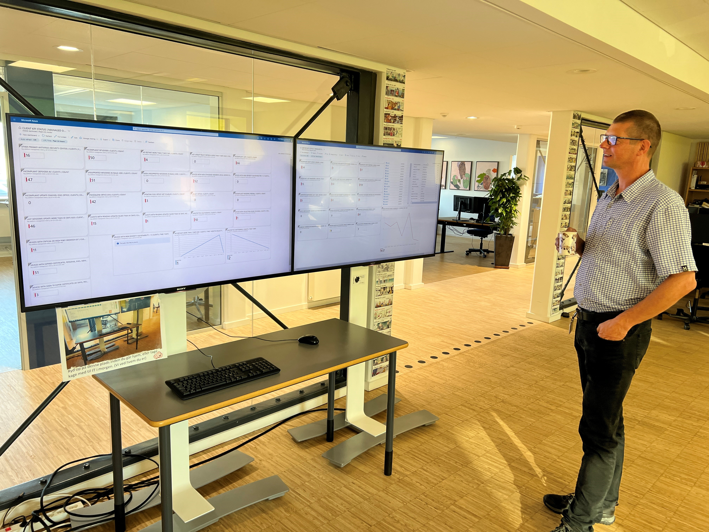

### Azure Workbooks
As mentioned the data can be viewed with Azure Workbooks deployed as part of the solution.

<details>
  <summary>Sample views included in provided Azure Workbooks</summary>

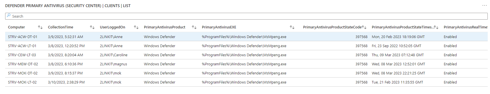


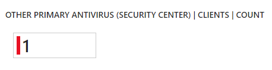

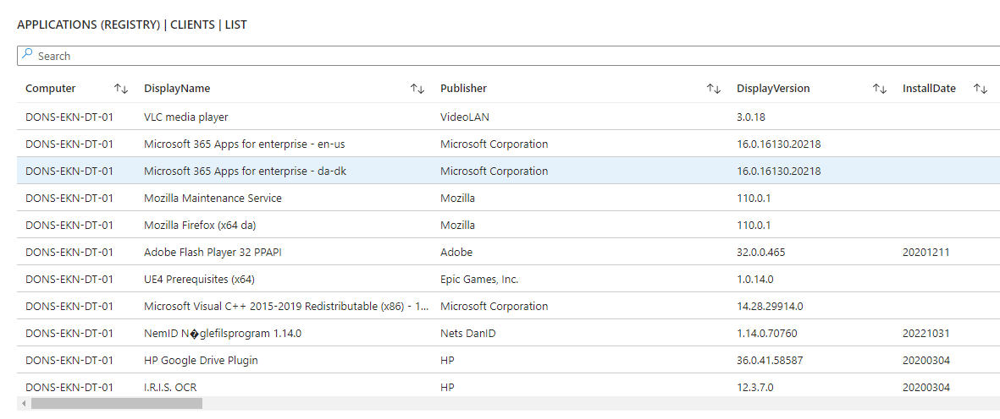

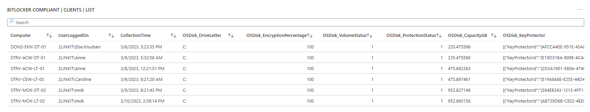

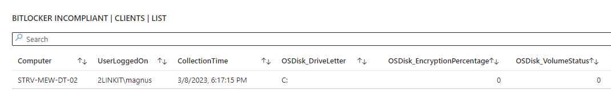

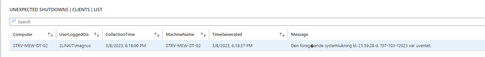

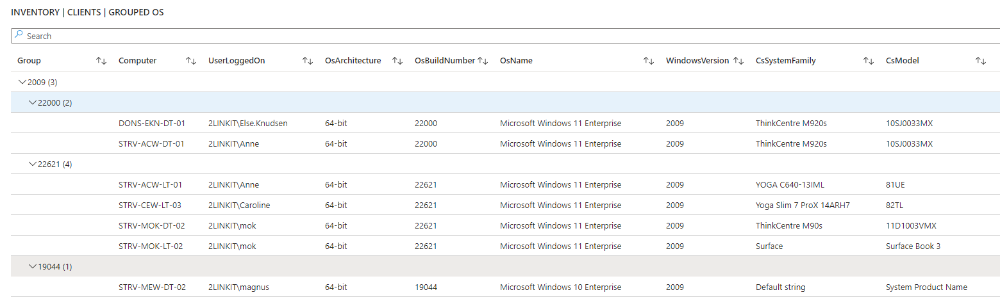

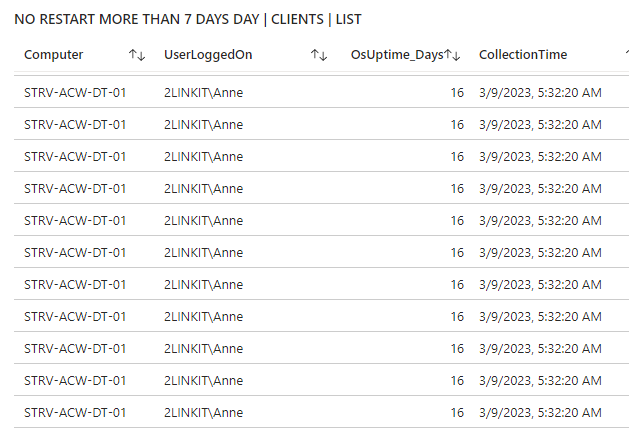

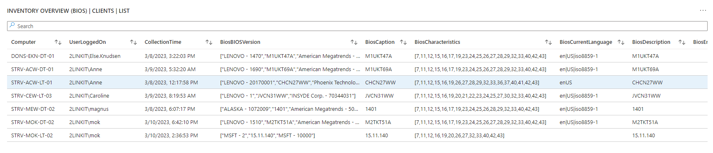

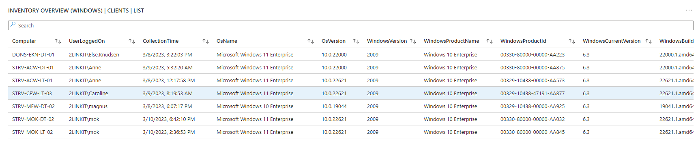

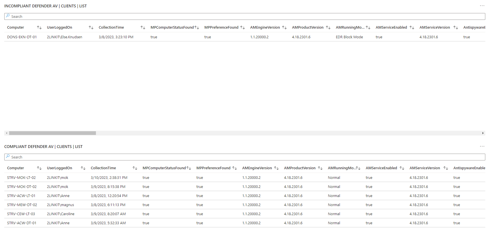

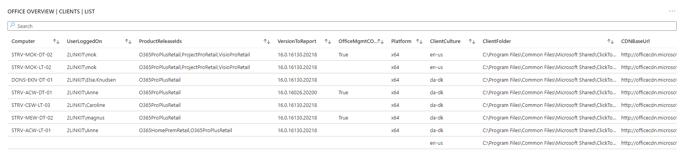

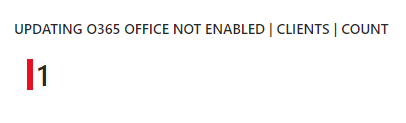

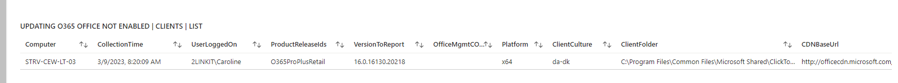


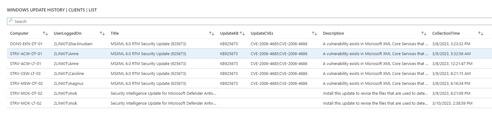

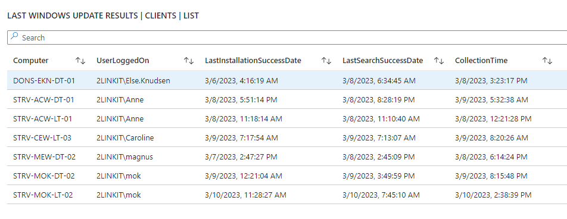

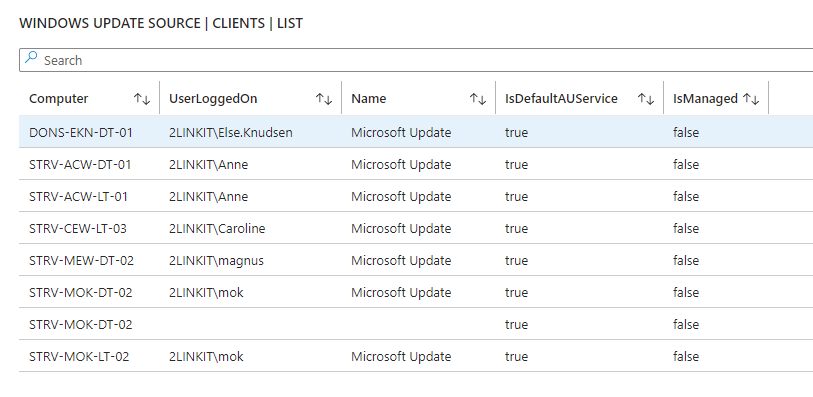

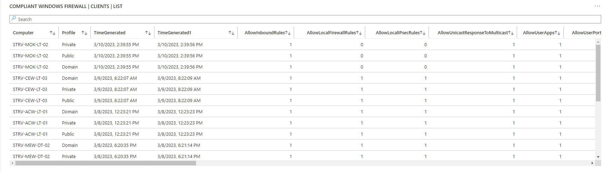
  
</details>


[Link to see the complete list of provided Azure Workbooks](https://github.com/KnudsenMorten/ClientInspectorV2-DeploymentKit#azure-workbooks-part-of-deployment)

### Azure Dashboards
When deployed by ClientInSpectorV2-DeploymentKit, you will have access to sample Azure Dashboards to get you started. They are created based on pinned parts from Azure Workbooks.

[Link to see the provided Azure Dashboards](https://github.com/KnudsenMorten/ClientInspectorV2-DeploymentKit#azure-dashboards-part-of-deployment)

### Can I make my own workbooks & dashboards - yes !!

If you want to add more views (or workbooks), you can start by investigating the collected data in the custom logs tables using KQL quries. Then make your new views in the workbooks - and pin your favorites to your dashboards.

### Sample query 1: Advanced hunting using Kusto (KQL) query
If you want to do advanced hunting, you can use traditional Kusto (KQL) queries in the tables
<details>
  <summary>Sample query</summary>
  
  ```js
InvClientDefenderAvV2_CL 
| where TimeGenerated > ago(31d)
| summarize CollectionTime = arg_max(CollectionTime, *) by Computer
| where ((AMRunningMode == "Not running") or 
    (parse_version(AMProductVersion) < parse_version("4.18.2203")) or 
    (MPComputerStatusFound == false) or (MPPreferenceFound == false) or
    (RealTimeProtectionEnabled == false) or
    (AntivirusSignatureAge > 7) or (AntispywareSignatureAge > 7) or (NISSignatureAge > 7) or
    (AMRunningMode == "EDR Block Mode") or (AMRunningMode == "Passive Mode") or
    (AntispywareEnabled == false) or
    ((TamperProtectionSource != "ATP") and (TamperProtectionSource != "Intune")) or (IsTamperProtected == false)
    )
| project
    Computer,
    UserLoggedOn,
    CollectionTime,
    MPComputerStatusFound,
    MPPreferenceFound,
    AMEngineVersion,
    AMProductVersion,
    AMRunningMode,
    AMServiceEnabled,
    AMServiceVersion,
    AntispywareEnabled,
    AntispywareSignatureAge,
    AntispywareSignatureLastUpdated,
    AntispywareSignatureVersion,
    AntivirusEnabled,
    AntivirusSignatureAge,
    AntivirusSignatureLastUpdated,
    AntivirusSignatureVersion,
    BehaviorMonitorEnabled,
    DefenderSignaturesOutOfDate,
    DisableAutoExclusions,
    DisableBehaviorMonitoring,
    DisableRealtimeMonitoring,
    DisableScanningMappedNetworkDrivesForFullScan,
    DisableScanningNetworkFiles,
    DisableScriptScanning,
    EnableControlledFolderAccess,
    EnableNetworkProtection,
    FullScanAge,
    IoavProtectionEnabled,
    IsTamperProtected,
    IsVirtualMachine,
    MAPSReporting,
    NISEnabled,
    NISEngineVersion,
    NISSignatureAge,
    NISSignatureLastUpdated,
    NISSignatureVersion,
    OnAccessProtectionEnabled,
    ProductStatus,
    PUAProtection,
    QuickScanAge,
    RealTimeProtectionEnabled,
    RealTimeScanDirection,
    RebootRequired,
    ScanAvgCPULoadFactor,
    SignatureUpdateCatchupInterval,
    SignatureUpdateInterval,
    SubmitSamplesConsent,
    TamperProtectionSource 
  ```
</details>

### Sample query 2: Kusto query to merge data from 3 tables
<details>
  <summary>Sample query</summary>
  
  ```js
InvClientComputerInfoBiosV2_CL 
| summarize TimeGenerated = arg_max(TimeGenerated,*) by Computer
	| join (InvClientComputerInfoSystemV2_CL
	|    summarize TimeGenerated = arg_max(TimeGenerated,*) by Computer)
	   on $left.Computer == $right.Computer
	| join (InvClientComputerOSInfoV2_CL 
	|    summarize TimeGenerated = arg_max(TimeGenerated,*) by Computer)
	   on $left.Computer == $right.Computer
| project Computer, UserLoggedOn, SerialNumber, Manufacturer, PCSystemType, SystemFamily, Model, Windows=Caption2, WindowsVersion=Version1, TimeGenerated
```
</details>

### Sample query 3: Query LogAnalytics data from Powershell
<details>
  <summary>Sample query</summary>
  
  ```js
Connect-AzAccount

#----------------------------------------------------------------------------------------------------------------------
# Variables
#----------------------------------------------------------------------------------------------------------------------

$LogAnalyticsWorkspaceId        = "e74ca75a-c0e6-4933-a4f7-e5ae943fe4ac" 

#----------------------------------------------------------------------------------------------------------------------
# Collecting Computer data from Azure LogAnalytics
#----------------------------------------------------------------------------------------------------------------------
$Query = @'
            InvClientComputerInfoBiosV2_CL 
            | summarize TimeGenerated = arg_max(TimeGenerated,*) by Computer
                | join (InvClientComputerInfoSystemV2_CL
                |    summarize TimeGenerated = arg_max(TimeGenerated,*) by Computer)
                   on $left.Computer == $right.Computer
                | join (InvClientComputerOSInfoV2_CL 
                |    summarize TimeGenerated = arg_max(TimeGenerated,*) by Computer)
                   on $left.Computer == $right.Computer
            | project Computer, UserLoggedOn, SerialNumber, Manufacturer, PCSystemType, SystemFamily, Model, Windows=Caption2, WindowsVersion=Version1, TimeGenerated
'@

write-output "Collecting computer information from LogAnalytics"
$Query = Invoke-AzOperationalInsightsQuery -WorkspaceId $LogAnalyticsWorkspaceId -Query $Query
$ComputerInfoArray = $Query.Results
$ComputerInfoArray
```
</details>

### Sample query4: Integrating data with other sources (warrantycheck against Lenovo warranty-database)
When we have the data in Azure LogAnalytics, we can start to integrate the data with other sources, like Dell or Lenovo warranty data via REST api lookup.

Here is an example of output, which was auto-created by a powershell script - extracting a list of computers & serial number - and then doing lookup to Lenovo warranty database to retrieve information about when the computer was purchased - and its warranty state.

[Sample warranty output (Excel), based on data collected by ClientInspector](https://github.com/KnudsenMorten/ClientInspectorV2/raw/main/img/WarrantyInfo.xlsx)
   
## Archicture & flow
ClientInspector (v2) is uploading the collected data into **custom logs** in **Azure LogAnalytics workspace** - using **Log ingestion API**, **Azure Data Collection Rules (DCR)** and **Azure Data Collection Endpoints (DCE)**. 

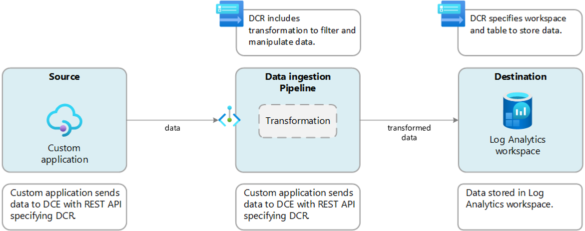

The old ClientInspector (v1) was using the HTTP Data Collector API and custom logs (MMA-format).

## Implementation (high-level steps)
The steps to setup ClientInspector in your environment are:
1. [Setup environment using ClientInSpectorV2-DeploymentKit](https://github.com/KnudsenMorten/ClientInspectorV2-DeploymentKit)

    [Click here to learn more about the Azure components in the solution](#infrastructure-setup-pre-requisite)

2. [Run ClientInspector the first time (initial setup)](#initial-configuration-of-clientinspector---creation-of-tablesdcrs-from-reference-computer). This step reads the source data - and creates the necessary custom log tables and DCR with the correct schema to understand the data

3. [Setup deployment job to let ClientInspector run every day to collect the inventory](#how-to-run-clientinspector-after-initial-setup-has-completed)


## Infrastructure setup (pre-requisite)
ClientInspector requires some prerequisites to run, which can be deployed using the [ClientInSpectorV2-DeploymentKit](https://github.com/KnudsenMorten/ClientInspectorV2-DeploymentKit)

<details>
  <summary>Detailed information about Azure components used as part of ClientInspector - and their purpose?</summary>

<br>

The following components are needed:

| Azure Resource                | Purpose                                           | More information |
| :-------------                | :-----                                            | :-----           |
| Any REST endpoint             | This is the source sending data                   |                  |
| Log Ingestion API             | This is the new API that replaces the old HTTP Data Collector API | https://learn.microsoft.com/en-us/azure/azure-monitor/logs/logs-ingestion-api-overview |
| Data Collection Endpoint (DCE)| This is the entry point of communication from the endpoint. Data is sent to a **Azure Data Collection Endpoint Ingestion Uri**. A single DCE can support multiple DCRs, so you can specify a different DCR for different sources and target tables. | https://learn.microsoft.com/en-us/azure/azure-monitor/essentials/data-collection-endpoint-overview?tabs=portal |
| Data Collection Rules (DCR)   | Data collection rules define data collected (schema) and specify how and where that data should be sent or stored. The DCR must understand the structure of the input data and the structure of the target table. If the two don't match, it can use a transformation to convert the source data to match the target table. You can also use the transformation to filter source data and perform any other calculations or conversions. | https://learn.microsoft.com/en-us/azure/azure-monitor/essentials/data-collection-rule-overview | 
| Azure LogAnaltyics Workspace  | Data is sent to custom logs in Azure LogAnalytics  | https://learn.microsoft.com/en-us/azure/azure-monitor/logs/log-analytics-overview |
| Azure Workbooks               | As part of the deployment, sample workbooks will be deployed  | https://learn.microsoft.com/en-us/azure/azure-monitor/visualize/workbooks-overview |
| Azure Dashboards              | As part of the deployment, sample workbooks will be deployed  | https://learn.microsoft.com/en-us/azure/azure-monitor/visualize/tutorial-logs-dashboards |
| Kusto (KQL)                   | Data can be analyzed using Kust (KQL) queries | https://learn.microsoft.com/en-us/azure/azure-monitor/logs/get-started-queries |

</details>


## Powershell function AzLogDcringestPS (pre-requisite)
ClientInspector requires the Powershell module, **AzLogDcrIngestPS**, developed by [Morten Knudsen, Microsoft MVP](https://mvp.microsoft.com/en-us/PublicProfile/5005156?fullName=Morten%20Knudsen).

Core features of Powershell module **AzLogDcrIngestPS**:
* create/update the DCRs and tables automatically - based on the source object schema
* validate the schema for naming convention issues. If exist found, it will mitigate the issues
* update schema of DCRs and tables, if the structure of the source object changes
* auto-fix if something goes wrong with a DCR or table
* can remove data from the source object, if there are colums of data you don't want to send
* can convert source objects based on CIM or PS objects into PSCustomObjects/array
* can add relevant information to each record like UserLoggedOn, Computer, CollectionTime

ClientInspector supports to include the Powershell functions in various ways:

You can download latest version here:

[AzLogDcringestPS (Github)](https://github.com/KnudsenMorten/AzLogDcrIngestPS)

[AzLogDcringestPS (Powershell Gallery)](https://www.powershellgallery.com/packages/AzLogDcrIngestPS)

### Authentication
Authentication for the Logs Ingestion API is performed at the DCE, which uses standard Azure Resource Manager authentication. 

A common strategy is to use an application ID and application key which is also the method used in ClientInspector.

### Source data
The source data sent by ClientInSpector is formatted in JSON and must match the structure expected by the DCR. 
It doesn't necessarily need to match the structure of the target table because the DCR can include a transformation to convert the data to match the table's structure.

ClientInspector uses several functions within the Powershell module, **AzLogDcIngestPS**, to handle source data adjustsments to **remove "noice" in data**, to **remove prohibited colums in tables/DCR** - and support needs for **transparency** with extra insight like **UserLoggedOn**, **CollectionTime**, **Computer**:

<details>
  <summary>Examples of how to use functions Convert-CimArrayToObjectFixStructure, Add-CollectionTimeToAllEntriesInArray, Add-ColumnDataToAllEntriesInArray, ValidateFix-AzLogAnalyticsTableSchemaColumnNames, Build-DataArrayToAlignWithSchema, Filter-ObjectExcludeProperty</summary>

```js
#-------------------------------------------------------------------------------------------
# Collecting data (in)
#-------------------------------------------------------------------------------------------
	
Write-Output ""
Write-Output "Collecting Bios information ... Please Wait !"

$DataVariable = Get-CimInstance -ClassName Win32_BIOS

#-------------------------------------------------------------------------------------------
# Preparing data structure
#-------------------------------------------------------------------------------------------

# convert CIM array to PSCustomObject and remove CIM class information
$DataVariable = Convert-CimArrayToObjectFixStructure -data $DataVariable -Verbose:$Verbose

# add CollectionTime to existing array
$DataVariable = Add-CollectionTimeToAllEntriesInArray -Data $DataVariable -Verbose:$Verbose

# add Computer & UserLoggedOn info to existing array
$DataVariable = Add-ColumnDataToAllEntriesInArray -Data $DataVariable -Column1Name Computer -Column1Data $Env:ComputerName -Column2Name UserLoggedOn -Column2Data $UserLoggedOn -Verbose:$Verbose

# Remove unnecessary columns in schema
$DataVariable = Filter-ObjectExcludeProperty -Data $DataVariable -ExcludeProperty __*,SystemProperties,Scope,Qualifiers,Properties,ClassPath,Class,Derivation,Dynasty,Genus,Namespace,Path,Property_Count,RelPath,Server,Superclass -Verbose:$Verbose

# Validating/fixing schema data structure of source data
$DataVariable = ValidateFix-AzLogAnalyticsTableSchemaColumnNames -Data $DataVariable -Verbose:$Verbose

# Aligning data structure with schema (requirement for DCR)
$DataVariable = Build-DataArrayToAlignWithSchema -Data $DataVariable -Verbose:$Verbose
````

You can verify the source object by running this command
````
# Get insight about the schema structure of an object BEFORE changes. Command is only needed to verify columns in schema
Get-ObjectSchemaAsArray -Data $DataVariable -Verbose:$Verbose
````
</details>

[Please see more details about available functions in AzLogDcrIngestPS - and how to use them here](https://github.com/KnudsenMorten/AzLogDcrIngestPS)


## Initial configuration of ClientInspector - creation of tables/DCRs from reference computer

<details>
  <summary>How to configure the initial setup of Azure LogAnalytics tables and Data Collection Rules (first-time)</summary>

<br>
I recommend to have a reference computer, which is used for table/DCR management. This way it is a controlled process, if changes must be made for example change of data structure
  
Configuration:

1. Create a folder on a reference machine for example C:\ClientInspectorV2. It can easily be your own computer

2. [Download the latest version of ClientInspector.ps1](https://raw.githubusercontent.com/KnudsenMorten/ClientInspectorV2/ClientInspector.ps1) - and place it in the folder created

3. Open the file ClientInspector.ps1 - and insert the variables that was the output the deployment using **ClientInSpectorV2-DeploymentKit**
```js
$TenantId                                   = "xxxx" 
$LogIngestAppId                             = "xxxx" 
$LogIngestAppSecret                         = "xxxx" 

$DceName                                    = "xxxx" 
$LogAnalyticsWorkspaceResourceId            = "xxxx"

$AzDcrPrefixClient                          = "xxx" 
$AzDcrSetLogIngestApiAppPermissionsDcrLevel = $false
$AzDcrLogIngestServicePrincipalObjectId     = "xxx" 
$AzDcrDceTableCreateFromReferenceMachine    = @()
$AzDcrDceTableCreateFromAnyMachine          = $true
```

4. [Download the latest version of AzLogDcringestPS.ps1](https://raw.githubusercontent.com/KnudsenMorten/AzLogDcrIngestPS/main/AzLogDcrIngestPS.psm1) - and place it in the folder created

5. Start Powershell as local admin

6. Start the script using this command
```js
C:\ClientInspector\ClientInspector.ps1 -PsFunctionLibrary LocalPath_Import -verbose:$true
```

7. It wil now run for 10-15 min and create the necessary tables & Data Collection Rules - based on the actual structure in your environment

8. When first run of the script has completed, then run it again. Now data will be sent into the solution.

9. Verify data is coming in using Kusto queries in the different tables. NOTE: In can take up approx 10 min for the first upload of data, as the pipeline needs to be created in backend

10. As the last change, we need to change 2 parameters in the parameters to tell ClientInspector to only make schema changes when run from the reference machine
```js
$AzDcrDceTableCreateFromReferenceMachine    = @("<<MyReferenceMachineComputerName>>")   # sample @("ComputerName")
$AzDcrDceTableCreateFromAnyMachine          = $false    # important so changes can only happen on reference machine
```
11. You are now ready to deploy it to your test group

</details>

## How to run ClientInspector after initial setup has completed?
You can run the ClientInspector script using your favorite deployment tool. 
Scripts for Microsoft Intune and ConfigMgr (or any other tool running a CMD-file) are provided. 

<details>
  <summary>How to deploy using Microsoft Intune ?</summary>

<br>
  You will run the inventory script using the method remediation script in Microsoft Intune.
  
1. [Download the detection script ClientInspector_Detection.ps1](https://raw.githubusercontent.com/KnudsenMorten/ClientInspectorV2/main/Intune/ClientInspector_Detection.ps1)

2. Open the file with your favorite editor. Adjust the frequency on how often you want the inventory to run
```js
##################################
# VARIABLES
##################################

    $RunEveryHours    = 8
    $LastRun_RegPath  = "HKLM:\SOFTWARE\ClientInspector"
    $LastRun_RegKey   = "ClientInSpector_System"
```
3. Now we need to create the remediation job. Go into Microsoft Intune portal -> Reports -> Endpoint Analysis --> Proactive remediations - and create a script package as shown below

NOTE: For remediation script, use the **ClientInspector.ps1** file

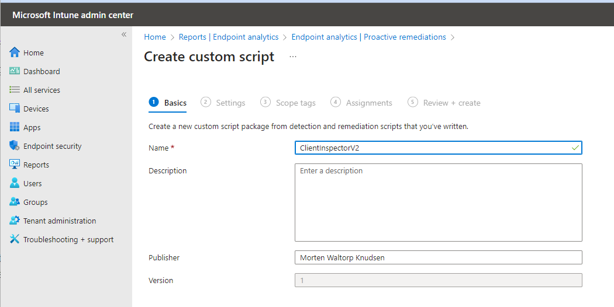

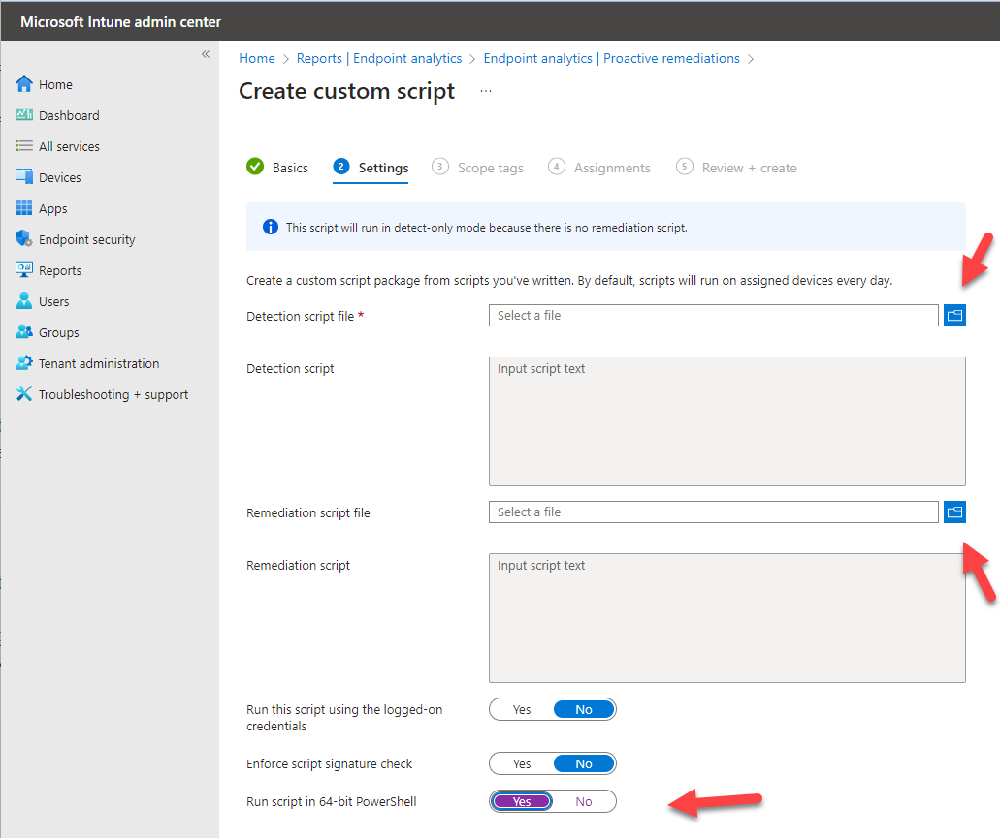

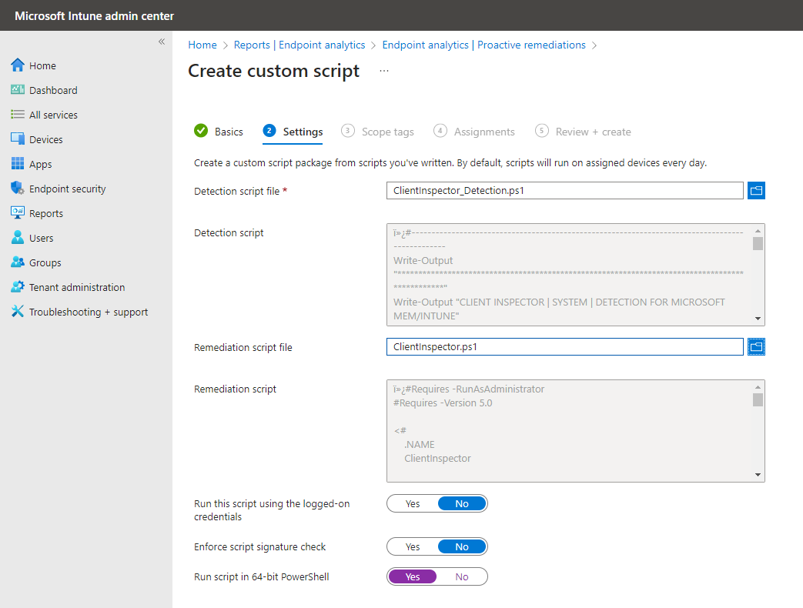

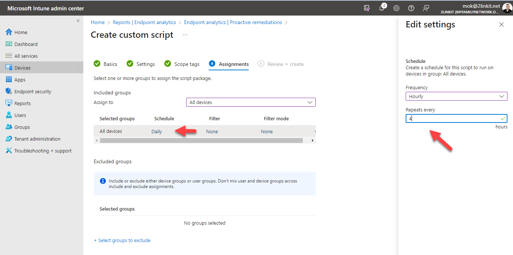

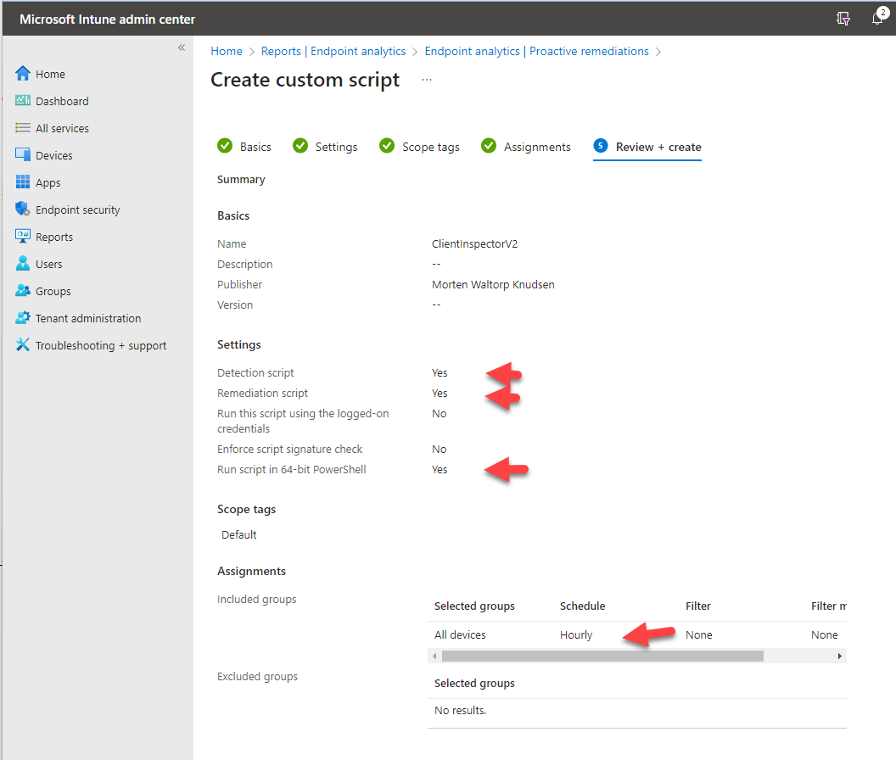

</details>


<details>
  <summary>How to deploy using ConfigMgr (or any other tool running a CMD-file) ?</summary>
  
<br>
You will run the inventory script by a traditional package / deployment
    
1. [Download the CMD-file ClientInspector.cmd](https://raw.githubusercontent.com/KnudsenMorten/ClientInspectorV2/ConfigMgr/ClientInspector.cmd)

2. [Download the latest version of ClientInspector.ps1](https://raw.githubusercontent.com/KnudsenMorten/ClientInspectorV2/ClientInspector.ps1)

3. Create a source structure on your ConfigMgr package source directory for example called ClientInspector. 

4. Copy the 2 needed files **ClientInspector.cmd** and **ClientInspector.ps1** into the directory

5. Make a package - and point the package to run **ClientInspector.cmd**

6. Make a deployment. NOTE: Make source to configure the deployment to download the package down to the client

</details>

