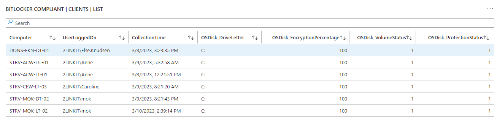
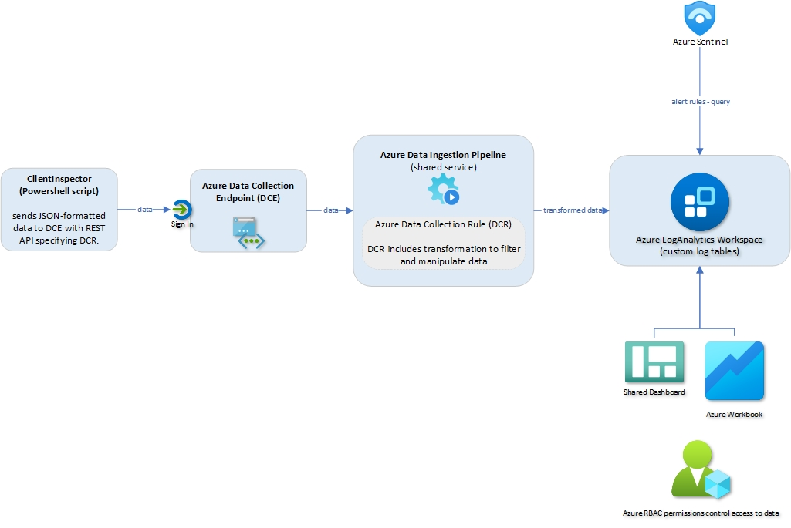
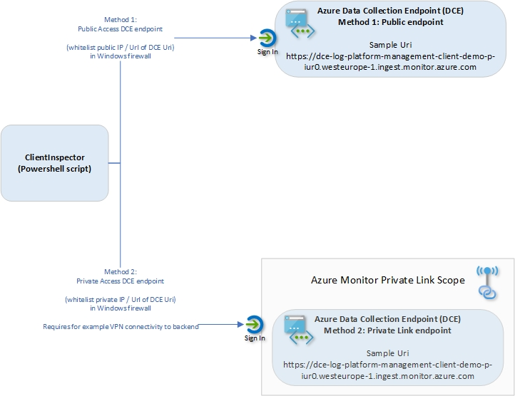

# Introduction to ClientInspector (v2)
Check out **ClientInspector**, which can help you get **great insight** to your complete **client environment**.

**Are you in control?** - or are some of your core infrastructure processes like **patching, antivirus, bitlocker enablement drifting**? Or would you like to do **advanced inventory**, where you can lookup your **warranty state** against Lenovo or Dell warranty, then keep reading.

The idea of the dashboards are that they will show where your infrastucture if drifting from best practice. Think of them as KPIs, where we might not be in control.

Instead of having a task with patching and managing antivirus, we will have KPIs, which will show, where computers are **not** patched - or where realtime protection in anvirus is not running - or machines which has bluesceened during the last 24 hours.


And it can help you ensure you are in control with core infratructure processes for a low price. **Data from 5000 clients doing daily ClientInspector inventory will cost you approx USD 100 per month **

Feel free to add more cool data-collections to suit your needs. 
If you want to take part in the community, please send me your collections, if you think they can be of great great value to others.
Drop me an email on mok@mortenknudsen.net with your code, then I will include it - for the benefit of the whole community.

I have a similar solution for Servers; **ServerInspector**. Unfortunately, it is not public.

**Disclaimer**
It is important for me to state that I'm NOT trying to build a separate management tool, which will compete with Microsoft security and management stack. This is just an **great showcase** of how you can built **cool solutions** - with the power of the **Microsoft Azure stack** including **Azure Loganalytics, Azure Data Collection Rules, Azure Data Collection Endpoints, Azure Workbooks, Azure Dashboards**. Nothing beats Microsoft Azure and M365 management and security stack. They are rock star solutions. But I'm really **passioned** about the **logging capabilities** and the power to bring data back from clients, servers and cloud - and getting **cool valueable information out of the data**.

[Thank You to the great people in Microsoft product teams - you are rock stars :smile:](#thank-you-to-the-great-people-in-microsoft-product-teams---you-are-rock-stars-smile)

Happy hunting :smile:


## What are being collected ?
**ClientInspector** can be used to collect lots of great information of from your **Windows clients** - and send the data to **Azure LogAnalytics Custom Tables**.

The script collects the following information (settings, information, configuration, state):
1.  User Logged On to Client
2.  Computer information - bios, processor, hardware info, Windows OS info, OS information, last restart
3.  Installed applications, both using WMI and registry
4.  Antivirus Security Center from Windows - default antivirus, state, configuration
5.  Microsoft Defender Antivirus - all settings including ASR, exclusions, realtime protection, etc
6.  Office - version, update channel config, SKUs
7.  VPN client - version, product
8.  LAPS - version
9.  Admin By Request (3rd party) - version
10. Windows Update - last result (when), windows update source information (where), pending updates, last installations (what)
11. Bitlocker - configuration
12. Eventlog - look for specific events including logon events, blue screens, etc.
13. Network adapters - configuration, installed adapters
14. IP information for all adapters
15. Local administrators group membership
16. Windows firewall - settings for all 3 modes
17. Group Policy - last refresh
18. TPM information - relavant to detect machines with/without TPM

## Source data - what data can I use ?
You can use **any source data** which can be retrieved by Powershell into an object (wmi, cim, external data, rest api, xml-format, json-format, csv-format, etc.)

ClientInspector uses several functions within the Powershell module, **AzLogDcIngestPS**, to handle source data adjustsments to **remove "noice" in data**, to **remove prohibited colums in tables/DCR** - and support needs for **transparency** with extra insight like **UserLoggedOn**, **CollectionTime**, **Computer**:

<details>
  <summary>Examples of how to use functions Convert-CimArrayToObjectFixStructure, Add-CollectionTimeToAllEntriesInArray, Add-ColumnDataToAllEntriesInArray, ValidateFix-AzLogAnalyticsTableSchemaColumnNames, Build-DataArrayToAlignWithSchema, Filter-ObjectExcludeProperty</summary>

```js
#-------------------------------------------------------------------------------------------
# Collecting data (in)
#-------------------------------------------------------------------------------------------
	
Write-Output ""
Write-Output "Collecting Bios information ... Please Wait !"

$DataVariable = Get-CimInstance -ClassName Win32_BIOS

#-------------------------------------------------------------------------------------------
# Preparing data structure
#-------------------------------------------------------------------------------------------

# convert CIM array to PSCustomObject and remove CIM class information
$DataVariable = Convert-CimArrayToObjectFixStructure -data $DataVariable -Verbose:$Verbose

# add CollectionTime to existing array
$DataVariable = Add-CollectionTimeToAllEntriesInArray -Data $DataVariable -Verbose:$Verbose

# add Computer & UserLoggedOn info to existing array
$DataVariable = Add-ColumnDataToAllEntriesInArray -Data $DataVariable -Column1Name Computer -Column1Data $Env:ComputerName -Column2Name UserLoggedOn -Column2Data $UserLoggedOn -Verbose:$Verbose

# Remove unnecessary columns in schema
$DataVariable = Filter-ObjectExcludeProperty -Data $DataVariable -ExcludeProperty __*,SystemProperties,Scope,Qualifiers,Properties,ClassPath,Class,Derivation,Dynasty,Genus,Namespace,Path,Property_Count,RelPath,Server,Superclass -Verbose:$Verbose

# Validating/fixing schema data structure of source data
$DataVariable = ValidateFix-AzLogAnalyticsTableSchemaColumnNames -Data $DataVariable -Verbose:$Verbose

# Aligning data structure with schema (requirement for DCR)
$DataVariable = Build-DataArrayToAlignWithSchema -Data $DataVariable -Verbose:$Verbose
````

You can verify the source object by running this command
````
# Get insight about the schema structure of an object BEFORE changes. Command is only needed to verify columns in schema
Get-ObjectSchemaAsArray -Data $DataVariable -Verbose:$Verbose
````
</details>

[Please see more details about available functions in AzLogDcrIngestPS - and how to use them here](https://github.com/KnudsenMorten/AzLogDcrIngestPS)


## Desired State Dashboards - How to get insight of my environment from the data ?
Initially, you will have access to Azure Dashboards installed by the [ClientInSpectorV2-DeploymentKit](https://github.com/KnudsenMorten/ClientInspectorV2-DeploymentKit)

The idea of the dashboards are that they will show where your infrastucture if drifting from best practice. Think of them as KPIs, where we might not be in control.

Instead of having a task with patching and managing antivirus, we will have KPIs, which will show, where computers are **not** patched - or where realtime protection in anvirus is not running - or machines which has bluesceened during the last 24 hours.


<details>
  <summary>More sample workbooks views included in solution</summary>





  
</details>

[Link to see the complete list of provided Azure Workbooks](https://github.com/KnudsenMorten/ClientInspectorV2-DeploymentKit#azure-workbooks-part-of-deployment)

### Azure Dashboards
When deployed by ClientInSpectorV2-DeploymentKit, you will have access to sample Azure Dashboards to get you started. They are created based on pinned parts from Azure Workbooks.

Each of the dashboards are based on Azure Workbooks, so if you want to drill down, you can click on a link and will get access to the detailed information.


[Link to see the provided Azure Dashboards](https://github.com/KnudsenMorten/ClientInspectorV2-DeploymentKit#azure-dashboards-part-of-deployment)

### Can I make my own workbooks & dashboards - yes you can :smile:
If you want to add more views (or workbooks), you can start by investigating the collected data in the custom logs tables using KQL quries. 

Then make your new views in the workbooks - and pin your favorites to your dashboards.

## How to query - Kusto (KQL) is the answer
If you don't know Kusto language, I recommend you to start playing around with it, as it is a really powerful language.

[Write your first query with Kusto Query Language](https://learn.microsoft.com/en-us/training/modules/write-first-query-kusto-query-language/)

[Analyze query results using KQL](https://learn.microsoft.com/en-us/training/modules/analyze-results-kusto-query-language/)

Below are 4 samples of queries to get you started - baed on the data from ClientInspector.

### Sample query 1: Advanced hunting using Kusto (KQL) query
If you want to do advanced hunting, you can use traditional Kusto (KQL) queries in the tables
<details>
  <summary>Sample query</summary>
  
  ```js
InvClientDefenderAvV2_CL 
| where TimeGenerated > ago(31d)
| summarize CollectionTime = arg_max(CollectionTime, *) by Computer
| where ((AMRunningMode == "Not running") or 
    (parse_version(AMProductVersion) < parse_version("4.18.2203")) or 
    (MPComputerStatusFound == false) or (MPPreferenceFound == false) or
    (RealTimeProtectionEnabled == false) or
    (AntivirusSignatureAge > 7) or (AntispywareSignatureAge > 7) or (NISSignatureAge > 7) or
    (AMRunningMode == "EDR Block Mode") or (AMRunningMode == "Passive Mode") or
    (AntispywareEnabled == false) or
    ((TamperProtectionSource != "ATP") and (TamperProtectionSource != "Intune")) or (IsTamperProtected == false)
    )
| project
    Computer,
    UserLoggedOn,
    CollectionTime,
    MPComputerStatusFound,
    MPPreferenceFound,
    AMEngineVersion,
    AMProductVersion,
    AMRunningMode,
    AMServiceEnabled,
    AMServiceVersion,
    AntispywareEnabled,
    AntispywareSignatureAge,
    AntispywareSignatureLastUpdated,
    AntispywareSignatureVersion,
    AntivirusEnabled,
    AntivirusSignatureAge,
    AntivirusSignatureLastUpdated,
    AntivirusSignatureVersion,
    BehaviorMonitorEnabled,
    DefenderSignaturesOutOfDate,
    DisableAutoExclusions,
    DisableBehaviorMonitoring,
    DisableRealtimeMonitoring,
    DisableScanningMappedNetworkDrivesForFullScan,
    DisableScanningNetworkFiles,
    DisableScriptScanning,
    EnableControlledFolderAccess,
    EnableNetworkProtection,
    FullScanAge,
    IoavProtectionEnabled,
    IsTamperProtected,
    IsVirtualMachine,
    MAPSReporting,
    NISEnabled,
    NISEngineVersion,
    NISSignatureAge,
    NISSignatureLastUpdated,
    NISSignatureVersion,
    OnAccessProtectionEnabled,
    ProductStatus,
    PUAProtection,
    QuickScanAge,
    RealTimeProtectionEnabled,
    RealTimeScanDirection,
    RebootRequired,
    ScanAvgCPULoadFactor,
    SignatureUpdateCatchupInterval,
    SignatureUpdateInterval,
    SubmitSamplesConsent,
    TamperProtectionSource 
  ```
</details>

### Sample query 2: Kusto query to merge data from 3 tables
<details>
  <summary>Sample query</summary>
  
  ```js
InvClientComputerInfoBiosV2_CL 
| summarize TimeGenerated = arg_max(TimeGenerated,*) by Computer
	| join (InvClientComputerInfoSystemV2_CL
	|    summarize TimeGenerated = arg_max(TimeGenerated,*) by Computer)
	   on $left.Computer == $right.Computer
	| join (InvClientComputerOSInfoV2_CL 
	|    summarize TimeGenerated = arg_max(TimeGenerated,*) by Computer)
	   on $left.Computer == $right.Computer
| project Computer, UserLoggedOn, SerialNumber, Manufacturer, PCSystemType, SystemFamily, Model, Windows=Caption2, WindowsVersion=Version1, TimeGenerated
```
</details>

### Sample query 3: Query LogAnalytics data from Powershell
<details>
  <summary>Sample query</summary>
  
  ```js
Connect-AzAccount

#----------------------------------------------------------------------------------------------------------------------
# Variables
#----------------------------------------------------------------------------------------------------------------------

$LogAnalyticsWorkspaceId        = "e74ca75a-c0e6-4933-a4f7-e5ae943fe4ac" 

#----------------------------------------------------------------------------------------------------------------------
# Collecting Computer data from Azure LogAnalytics
#----------------------------------------------------------------------------------------------------------------------
$Query = @'
            InvClientComputerInfoBiosV2_CL 
            | summarize TimeGenerated = arg_max(TimeGenerated,*) by Computer
                | join (InvClientComputerInfoSystemV2_CL
                |    summarize TimeGenerated = arg_max(TimeGenerated,*) by Computer)
                   on $left.Computer == $right.Computer
                | join (InvClientComputerOSInfoV2_CL 
                |    summarize TimeGenerated = arg_max(TimeGenerated,*) by Computer)
                   on $left.Computer == $right.Computer
            | project Computer, UserLoggedOn, SerialNumber, Manufacturer, PCSystemType, SystemFamily, Model, Windows=Caption2, WindowsVersion=Version1, TimeGenerated
'@

write-output "Collecting computer information from LogAnalytics"
$Query = Invoke-AzOperationalInsightsQuery -WorkspaceId $LogAnalyticsWorkspaceId -Query $Query
$ComputerInfoArray = $Query.Results
$ComputerInfoArray
```
</details>

### Sample query 4: Integrating data with other sources (warrantycheck against Lenovo warranty-database)
When we have the data in Azure LogAnalytics, we can start to integrate the data with other sources, like Dell or Lenovo warranty data via REST api lookup.

Here is an example of output, which was auto-created by a powershell script - extracting a list of computers & serial number - and then doing lookup to Lenovo warranty database to retrieve information about when the computer was purchased - and its warranty state.

[Sample warranty output (Excel), based on data collected by ClientInspector](https://github.com/KnudsenMorten/ClientInspectorV2/raw/main/img/WarrantyInfo.xlsx)
   
## Archicture & flow of ClientInspector ?
ClientInspector (v2) is uploading the collected data into **custom logs** in **Azure LogAnalytics workspace** - using **Log ingestion API**, **Azure Data Collection Rules (DCR)** and **Azure Data Collection Endpoints (DCE)**. 



### Networking
You have 2 options for connectivity to Azure for data upload: **public access** or **private access**



You need to allow the following endpoints in your firewall:
|Endpoint|Purpose|Port|Direction|Bypass HTTPS Inspection|Example|
|:-------|:------|:----|:-------|:----------------------|:------|
|global.handler.control.monitor.azure.com|Access control service|Port 443|Outbound|Yes|-|
|dce logs ingestion uri|Ingest logs data|Port 443|Outbound|Yes|https://dce-log-platform-management-client-demo-p-iur0.westeurope-1.ingest.monitor.azure.com|


## Implementation
<details>
  <summary>Azure components used as part of ClientInspector - and their purpose?</summary>

<br>

The following components are needed:

| Azure Resource                | Purpose                                           | More information |
| :-------------                | :-----                                            | :-----           |
| Any REST endpoint             | This is the source sending data                   |                  |
| Log Ingestion API             | This is the new API that replaces the old HTTP Data Collector API | https://learn.microsoft.com/en-us/azure/azure-monitor/logs/logs-ingestion-api-overview |
| Data Collection Endpoint (DCE)| This is the entry point of communication from the endpoint. Data is sent to a **Azure Data Collection Endpoint Ingestion Uri**. A single DCE can support multiple DCRs, so you can specify a different DCR for different sources and target tables. | https://learn.microsoft.com/en-us/azure/azure-monitor/essentials/data-collection-endpoint-overview?tabs=portal |
| Data Collection Rules (DCR)   | Data collection rules define data collected (schema) and specify how and where that data should be sent or stored. The DCR must understand the structure of the input data and the structure of the target table. If the two don't match, it can use a transformation to convert the source data to match the target table. You can also use the transformation to filter source data and perform any other calculations or conversions. | https://learn.microsoft.com/en-us/azure/azure-monitor/essentials/data-collection-rule-overview | 
| Azure LogAnaltyics Workspace  | Data is sent to custom logs in Azure LogAnalytics  | https://learn.microsoft.com/en-us/azure/azure-monitor/logs/log-analytics-overview |
| Azure Workbooks               | As part of the deployment, sample workbooks will be deployed  | https://learn.microsoft.com/en-us/azure/azure-monitor/visualize/workbooks-overview |
| Azure Dashboards              | As part of the deployment, sample workbooks will be deployed  | https://learn.microsoft.com/en-us/azure/azure-monitor/visualize/tutorial-logs-dashboards |
| Kusto (KQL)                   | Data can be analyzed using Kust (KQL) queries | https://learn.microsoft.com/en-us/azure/azure-monitor/logs/get-started-queries |

</details>

The steps to setup ClientInspector in your environment are:
1. [Setup environment using ClientInSpectorV2-DeploymentKit](https://github.com/KnudsenMorten/ClientInspectorV2-DeploymentKit)

2. Run ClientInspector the first time (initial setup) - see more below
<details>
  <summary>How to configure the initial setup of Azure LogAnalytics tables and Data Collection Rules (first-time)</summary>

<br>
I recommend to have a reference computer, which is used for table/DCR management. This way it is a controlled process, if changes must be made for example change of data structure
<br>
Configuration:

1. Create a folder on a reference machine for example C:\ClientInspectorV2. It can easily be your own computer

2. [Download the latest version of ClientInspector.ps1](https://raw.githubusercontent.com/KnudsenMorten/ClientInspectorV2/ClientInspector.ps1) - and place it in the folder created

3. Open the file ClientInspector.ps1 - and insert the variables that was the output the deployment using **ClientInSpectorV2-DeploymentKit**
```js
$TenantId                                   = "xxxx" 
$LogIngestAppId                             = "xxxx" 
$LogIngestAppSecret                         = "xxxx" 

$DceName                                    = "xxxx" 
$LogAnalyticsWorkspaceResourceId            = "xxxx"

$AzDcrPrefixClient                          = "xxx" 
$AzDcrSetLogIngestApiAppPermissionsDcrLevel = $false
$AzDcrLogIngestServicePrincipalObjectId     = "xxx" 
$AzDcrDceTableCreateFromReferenceMachine    = @()
$AzDcrDceTableCreateFromAnyMachine          = $true
```

4. [Download the latest version of AzLogDcringestPS.ps1](https://raw.githubusercontent.com/KnudsenMorten/AzLogDcrIngestPS/main/AzLogDcrIngestPS.psm1) - and place it in the folder created

5. Start Powershell as local admin

6. Start the script using this command
```js
C:\ClientInspector\ClientInspector.ps1 -PsFunctionLibrary LocalPath_Import -verbose:$true
```

7. It wil now run for 10-15 min and create the necessary tables & Data Collection Rules - based on the actual structure in your environment

8. When first run of the script has completed, then run it again. Now data will be sent into the solution.

9. Verify data is coming in using Kusto queries in the different tables. NOTE: In can take up approx 10 min for the first upload of data, as the pipeline needs to be created in backend

10. As the last change, we need to change 2 parameters in the parameters to tell ClientInspector to only make schema changes when run from the reference machine
```js
$AzDcrDceTableCreateFromReferenceMachine    = @("<<MyReferenceMachineComputerName>>")   # sample @("ComputerName")
$AzDcrDceTableCreateFromAnyMachine          = $false    # important so changes can only happen on reference machine
```
11. You are now ready to deploy it to your test group

</details>

3. Setup deployment job to let ClientInspector run every day to collect the inventory. You can run the ClientInspector script using your favorite deployment tool. Scripts for Microsoft Intune and ConfigMgr (or any other tool running a CMD-file) are provided. 
<details>
  <summary>How to deploy using Microsoft Intune ?</summary>

<br>
  You will run the inventory script using the method remediation script in Microsoft Intune.
  
1. [Download the detection script ClientInspector_Detection.ps1](https://raw.githubusercontent.com/KnudsenMorten/ClientInspectorV2/main/Intune/ClientInspector_Detection.ps1)

2. Open the file with your favorite editor. Adjust the frequency on how often you want the inventory to run
```js
##################################
# VARIABLES
##################################

    $RunEveryHours    = 8
    $LastRun_RegPath  = "HKLM:\SOFTWARE\ClientInspector"
    $LastRun_RegKey   = "ClientInSpector_System"
```
3. Now we need to create the remediation job. Go into Microsoft Intune portal -> Reports -> Endpoint Analysis --> Proactive remediations - and create a script package as shown below

NOTE: For remediation script, use the **ClientInspector.ps1** file


</details>


<details>
  <summary>How to deploy using ConfigMgr (or any other tool running a CMD-file) ?</summary>
  
<br>
You will run the inventory script by a traditional package / deployment
    
1. [Download the CMD-file ClientInspector.cmd](https://raw.githubusercontent.com/KnudsenMorten/ClientInspectorV2/ConfigMgr/ClientInspector.cmd)

2. [Download the latest version of ClientInspector.ps1](https://raw.githubusercontent.com/KnudsenMorten/ClientInspectorV2/ClientInspector.ps1)

3. Create a source structure on your ConfigMgr package source directory for example called ClientInspector. 

4. Copy the 2 needed files **ClientInspector.cmd** and **ClientInspector.ps1** into the directory

5. Make a package - and point the package to run **ClientInspector.cmd**

6. Make a deployment. NOTE: Make source to configure the deployment to download the package down to the client

</details>


## Dependencies

### Powershell module AzLogDcringestPS - built by me (Morten Knudsen)

ClientInspector requires the Powershell module, **AzLogDcrIngestPS**

Core features of Powershell module **AzLogDcrIngestPS**:
* create/update the DCRs and tables automatically - based on the source object schema
* validate the schema for naming convention issues. If exist found, it will mitigate the issues
* update schema of DCRs and tables, if the structure of the source object changes
* auto-fix if something goes wrong with a DCR or table
* can remove data from the source object, if there are colums of data you don't want to send
* can convert source objects based on CIM or PS objects into PSCustomObjects/array
* can add relevant information to each record like UserLoggedOn, Computer, CollectionTime

You can download latest version here:

[AzLogDcringestPS (Github)](https://github.com/KnudsenMorten/AzLogDcrIngestPS)

[AzLogDcringestPS (Powershell Gallery)](https://www.powershellgallery.com/packages/AzLogDcrIngestPS)

</details>


### 3rd party Powershell modules
|ModuleName|Purpose|More info|Credit|
|:---------|:------|:--------|:-----|
|NuGet|Common Package provider used to deploy many Powershell modules<br><br>Package Provider will automatically be installed on computer when script runs|[Link](https://www.nuget.org/packages|
|PSWindowsUpdate|Collection of Windows Update information (pending updates, installed updates, etc.)<br><br>Module will automatically be installed on computer when script runs|[Link](https://www.powershellgallery.com/packages/PSWindowsUpdate)|Michal Gajda


## Security
The security of **ClientInspector** are divided into 4 layers: **data-in**, **data-upload** (send to backend) and **data-view** (dashboards) - and **schema-management**


| Phase | Security Implementation |Delegations / Permissions|
|:------|:------------------------|:------------------------|
|Data-in (collection)|This phase is controlled by the method you choose to do the actual collection (Intune, ConfigMg or other 3rd party)|Script needs to run as local admin (system context) to be able to collect core data from hardware & Windows
|Data-upload|Authentication for the Logs Ingestion API is performed at the DCE, which uses standard Azure Resource Manager authentication.<br><br>A common strategy is to use an application ID and application key which is also the method used in ClientInspector.<br><br>Azure AppId & Secret are stored in the header of ClientInspector for simplicity purpose<br><br>It is also possible to use Azure Keyvault for storing the AppId and Secret|[Details covered in ClientInspectV2-DeploymentKit](https://github.com/KnudsenMorten/ClientInspectorV2-DeploymentKit#security-1)
|Data-view|Azure RCAC permissions|Give access to your Azure LogAnalytics, Azure Workbooks and Azure Dashboards|
|Schema-management|Method 1: Azure RBAC (recommended)<br><br>Method 2:Azure app with secret or certificate|[Details covered in ClientInSpectorV2-DeploymentKit](https://github.com/KnudsenMorten/ClientInspectorV2-DeploymentKit#azure-rbac-security-adjustment-separation-of-permissions-between-log-ingestion-and-tabledcr-management)


## Thank You to the great people in Microsoft product teams - you are rock stars :smile:
I would like to give **big credits** to a few people, who I have worked together with on building **AzLogDcrIngestPS Powershell module** and **my daily work with the Azure log & viewing capabilities**:

|Name|Role|
|:---|:---|
|Ivan Varnitski|Program Manager - Azure Pipeline|
|Evgeny Ternovsky|Program Manager - Azure Pipeline|
|Nick Kiest|Program Manager - Azure Data Collection Rules|
|Oren Salzberg|Program Manager - Azure LogAnalytics|
|Guy Wild|Technical Writer - Azure LogAnalytics|
|John Gardner|Program Manager - Azure Workbooks|
|Shikha Jain|Program Manager - Azure Workbooks|
|Shayoni Seth|Program Manager - Azure Monitor Agent|
|Jeff Wolford|Program Manager - Azure Monitor Agent|
|Xema Pathak|Program Manager - Azure VMInsight (integration to Azure Monitor Agent)|


**Ivan & Evgeny from Azure Pipeline**


**Program Managers from Azure LogAnalytics**


**Nick, Shayoni & Xema from Azure Data Collection Rules, Azure Monitor Agent and Azure VMInsight**


**John & Shikha from Azure Workbooks**

