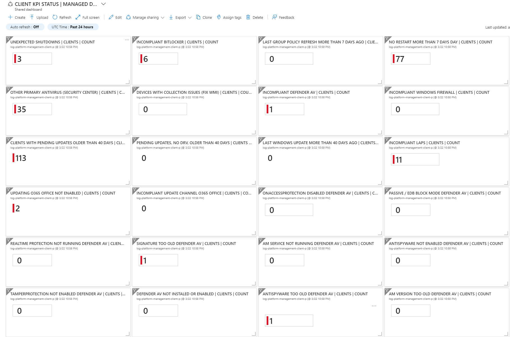
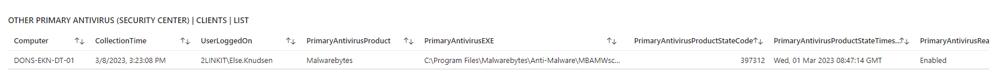
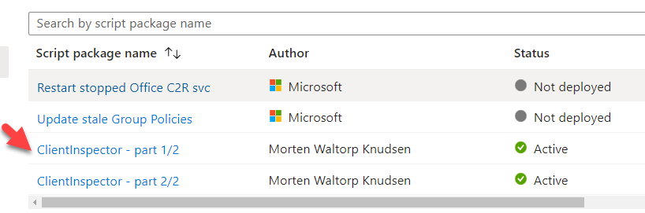

# Introduction to ClientInspector (v2)


**Are you in control?** - or are some of your core infrastructure processes like **patching, antivirus, bitlocker enablement** drifting? Or would you like to do **advanced inventory**, where you can lookup your **warranty state** against Lenovo or Dell warranty, then keep reading.

Check out **ClientInspector**, which can help you get **great insight** to your complete **client environment**.

ClientInspector is **free** to the community - built to be a **cool showcase** of how you can bring back **data** from your clients using **Azure Log Ingestion Pipeline**, **Azure Data Collection Rules**, **Azure LogAnalytics**; view them with **Azure Monitor & Azure Dashboards** - and get "drift-alerts" using **Microsoft Sentinel**.

[Video 3m 01s - Dashboards](https://youtu.be/0MKPgzvDNRk)  

### Archicture & flow of ClientInspector
ClientInspector (v2) is uploading the collected data into **custom logs** in **Azure LogAnalytics workspace** - using **Log ingestion API**, **Azure Data Collection Rules (DCR)** and **Azure Data Collection Endpoints (DCE)**. 


### Sample Dashboards



#### Disclaimer
It is important for me to state that I'm not trying to build a separate management tool, which will compete with Microsoft security and management stack. 

Nothing beats Microsoft Azure/M365 management and security stack. They are rock star solutions. 

But I'm really **passioned** about the **logging capabilities** and the power **to bring data back from clients, servers, cloud and 3rd party systems** - and getting **cool valueable information out of the data**.

I have a similar solution for **servers** - **ServerInspector**. Unfortunately, it is not public.

[Big Thanks to the great people in Microsoft product teams - you are rock stars :smile:](#big-thanks-to-the-great-people-in-microsoft-product-teams---you-are-rock-stars-smile)

Happy hunting :smile:

<br>

# Quick Links
[What data is being collected ?](#what-data-is-being-collected-)  
[Desired State Dashboards - How to get insight of my environment from the data ?](#desired-state-dashboards---how-to-get-insight-of-my-environment-from-the-data-)  
[How do I query the data? - Kusto (KQL) is the answer](#how-do-i-query-the-data---kusto-kql-is-the-answer)  
[Architecture, Schema & Networking](#architecture-schema--networking)  
[Implementation](#implementation)  
[Dependencies](#dependencies)  
[Running ClientInspector.ps1 - 3 modes](#running-clientinspectorps1---3-modes)  
[Sample output of ClientInspector](#sample-output-of-clientinspector)  
[Security](#security)  
[Layout of ClientInspector data-set](#layout-of-clientinspector-data-set)  
[Verbose-mode & More help](#verbose-mode--more-help)  
[Cost - How much does it cost to store these data ?](#cost---how-much-does-it-cost-to-store-these-data-) 
[Bug findings, please inform me](#bugs-findings-please-inform-me)  
[Contact](#contact)

# Videos of solution
[Video 3m 19s - Running ClientInspector using commandline (normal mode)](https://youtu.be/4kA4BE0zJ9g)  
[Video 1m 40s - Automatic creation of 2 tables & DCRs (verbose mode)](https://youtu.be/rIUNs3yT-eI)  
[Video 1m 37s - Automatic creation of 2 tables & DCRs (normal mode)](https://youtu.be/khQMDcON6r8)  
[Video 1m 34s - See schema of DCR and table)](https://youtu.be/NDSNhvpa4Gs)  
[Video 2m 19s - Data manipulation](https://youtu.be/OZWj7xZHLI8)  
[Video 1m 58s - Kusto queries against data](https://youtu.be/_GlI0h7ZOsg)  
[Video 3m 01s - Dashboards](https://youtu.be/0MKPgzvDNRk)  
[Video 0m 48s - Sample usage of data - lookup against Lenovo warranty db](https://youtu.be/3ZDyTwiLU0w)  
[Video 7m 25s - Deployment via ClientInspector DeploymentKit](https://youtu.be/_RNlSqRcetg)  

<br>

# What data is being collected ?
**ClientInspector** can be used to collect lots of great information of from your **Windows clients** - and send the data to **Azure LogAnalytics Custom Tables**.

The script collects the following information (settings, information, configuration, state):
1.  User Logged On to Client
2.  Computer information - bios, processor, hardware info, Windows OS info, OS information, last restart
3.  Installed applications, both using WMI and registry
4.  Antivirus Security Center from Windows - default antivirus, state, configuration
5.  Microsoft Defender Antivirus - all settings including ASR, exclusions, realtime protection, etc
6.  Office - version, update channel config, SKUs
7.  VPN client - version, product
8.  LAPS - version
9.  Admin By Request (3rd party) - version
10. Windows Update - last result (when), windows update source information (where), pending updates, last installations (what)
11. Bitlocker - configuration
12. Eventlog - look for specific events including logon events, blue screens, etc.
13. Network adapters - configuration, installed adapters
14. IP information for all adapters
15. Local administrators group membership
16. Windows firewall - settings for all 3 modes
17. Group Policy - last refresh
18. TPM information - relavant to detect machines with/without TPM

Feel free to add more cool data-collections to suit your needs. 
If you want to take part in the community, please send me an email with your collections, if you think they can be of benefit of the whole community.

<br>

# Source data - what data can I use ?
You can use **any source data** which can be retrieved into Powershell (wmi, cim, external data, rest api, xml-format, json-format, csv-format, etc.)

It is very important to understand, that the data typically needs to be manipulated before sending them - to ensure they are valid and any irrelevant data has been removed.

ClientInspector uses all of the 24 functions within the Powershell module, **AzLogDcIngestPS**, to handle source data manipulation to **remove "noice" in data**, to **rename prohibited colums in tables/DCR** - and support needs for **transparency** with extra insight like **UserLoggedOn**, **CollectionTime**, **Computer**:

<details>
  <summary>Examples of how to use functions Convert-CimArrayToObjectFixStructure, Add-CollectionTimeToAllEntriesInArray, Add-ColumnDataToAllEntriesInArray, ValidateFix-AzLogAnalyticsTableSchemaColumnNames, Build-DataArrayToAlignWithSchema, Filter-ObjectExcludeProperty</summary>

```js
#-------------------------------------------------------------------------------------------
# Collecting data (in)
#-------------------------------------------------------------------------------------------
	
Write-Output ""
Write-Output "Collecting Bios information ... Please Wait !"

$DataVariable = Get-CimInstance -ClassName Win32_BIOS

#-------------------------------------------------------------------------------------------
# Preparing data structure
#-------------------------------------------------------------------------------------------

# convert CIM array to PSCustomObject and remove CIM class information
$DataVariable = Convert-CimArrayToObjectFixStructure -data $DataVariable -Verbose:$Verbose

# add CollectionTime to existing array
$DataVariable = Add-CollectionTimeToAllEntriesInArray -Data $DataVariable -Verbose:$Verbose

# add Computer & UserLoggedOn info to existing array
$DataVariable = Add-ColumnDataToAllEntriesInArray -Data $DataVariable -Column1Name Computer -Column1Data $Env:ComputerName -Column2Name UserLoggedOn -Column2Data $UserLoggedOn -Verbose:$Verbose

# Remove unnecessary columns in schema
$DataVariable = Filter-ObjectExcludeProperty -Data $DataVariable -ExcludeProperty __*,SystemProperties,Scope,Qualifiers,Properties,ClassPath,Class,Derivation,Dynasty,Genus,Namespace,Path,Property_Count,RelPath,Server,Superclass -Verbose:$Verbose

# Validating/fixing schema data structure of source data
$DataVariable = ValidateFix-AzLogAnalyticsTableSchemaColumnNames -Data $DataVariable -Verbose:$Verbose

# Aligning data structure with schema (requirement for DCR)
$DataVariable = Build-DataArrayToAlignWithSchema -Data $DataVariable -Verbose:$Verbose
````

You can verify the source object by running this command
````
# Get insight about the schema structure of an object BEFORE changes. Command is only needed to verify columns in schema
Get-ObjectSchemaAsArray -Data $DataVariable -Verbose:$Verbose
````
</details>

[Please see more details about available functions in AzLogDcrIngestPS - and how to use them here](https://github.com/KnudsenMorten/AzLogDcrIngestPS)

<br>

# Desired State Dashboards - How to get insight of my environment from the data ?
As part of the initial deployment using [ClientInSpectorV2-DeploymentKit](https://github.com/KnudsenMorten/ClientInspectorV2-DeploymentKit), you will have access to lots of Azure Dashboards and Azure Workbooks. 

[Video 3m 01s - Dashboards](https://youtu.be/0MKPgzvDNRk)  

The idea of the dashboards is that they will show where your infrastucture is drifting from 'desired state'. Think of them as KPIs, where the infrastructure is not in control.

Instead of having a task with patching and managing antivirus, you can consider to have KPIs, which will show, where computers are **not** patched - or where realtime protection in anvirus is **not** running - or machines which **has bluescreened** during the last 24 hours.

This is the same concept as **Microsoft Secure Score**.


<details>
  <summary>More sample views included in solution</summary>





  
</details>

[Link to see the complete list of provided Azure Workbooks](https://github.com/KnudsenMorten/ClientInspectorV2-DeploymentKit#azure-workbooks-part-of-deployment)

All of the sample Azure Dashboards are created based on pinned parts from Azure Workbooks, so if you want to drill down, you can click on a link and will get access to the detailed information.


[Link to see the provided Azure Dashboards](https://github.com/KnudsenMorten/ClientInspectorV2-DeploymentKit#azure-dashboards-part-of-deployment)

## Can I make my own workbooks & dashboards - yes, you can :smile:
If you want to add more dashboards or workbooks, you will typically start by investigating the collected data in the custom logs tables using KQL quries. When you have found the desired query, you can make new views in workbooks - and pin your favorites to your dashboards.

<br>

# How do I query the data? - Kusto (KQL) is the answer
If you don't know Kusto language, I recommend you to start playing around with it, as it is a really powerful language.

[Video 1m 58s - Kusto queries against data](https://youtu.be/_GlI0h7ZOsg)  
[Video 3m 01s - Dashboards](https://youtu.be/0MKPgzvDNRk)  

[Write your first query with Kusto Query Language](https://learn.microsoft.com/en-us/training/modules/write-first-query-kusto-query-language/)

[Analyze query results using KQL](https://learn.microsoft.com/en-us/training/modules/analyze-results-kusto-query-language/)

Below are 4 samples of queries to get you started - baed on the data from ClientInspector.

## Sample query 1: Advanced hunting using Kusto (KQL) query
If you want to do advanced hunting, you can use traditional Kusto (KQL) queries in the tables
<details>
  <summary>Sample query</summary>
  
  ```js
InvClientDefenderAvV2_CL 
| where TimeGenerated > ago(31d)
| summarize CollectionTime = arg_max(CollectionTime, *) by Computer
| where ((AMRunningMode == "Not running") or 
    (parse_version(AMProductVersion) < parse_version("4.18.2203")) or 
    (MPComputerStatusFound == false) or (MPPreferenceFound == false) or
    (RealTimeProtectionEnabled == false) or
    (AntivirusSignatureAge > 7) or (AntispywareSignatureAge > 7) or (NISSignatureAge > 7) or
    (AMRunningMode == "EDR Block Mode") or (AMRunningMode == "Passive Mode") or
    (AntispywareEnabled == false) or
    ((TamperProtectionSource != "ATP") and (TamperProtectionSource != "Intune")) or (IsTamperProtected == false)
    )
| project
    Computer,
    UserLoggedOn,
    CollectionTime,
    MPComputerStatusFound,
    MPPreferenceFound,
    AMEngineVersion,
    AMProductVersion,
    AMRunningMode,
    AMServiceEnabled,
    AMServiceVersion,
    AntispywareEnabled,
    AntispywareSignatureAge,
    AntispywareSignatureLastUpdated,
    AntispywareSignatureVersion,
    AntivirusEnabled,
    AntivirusSignatureAge,
    AntivirusSignatureLastUpdated,
    AntivirusSignatureVersion,
    BehaviorMonitorEnabled,
    DefenderSignaturesOutOfDate,
    DisableAutoExclusions,
    DisableBehaviorMonitoring,
    DisableRealtimeMonitoring,
    DisableScanningMappedNetworkDrivesForFullScan,
    DisableScanningNetworkFiles,
    DisableScriptScanning,
    EnableControlledFolderAccess,
    EnableNetworkProtection,
    FullScanAge,
    IoavProtectionEnabled,
    IsTamperProtected,
    IsVirtualMachine,
    MAPSReporting,
    NISEnabled,
    NISEngineVersion,
    NISSignatureAge,
    NISSignatureLastUpdated,
    NISSignatureVersion,
    OnAccessProtectionEnabled,
    ProductStatus,
    PUAProtection,
    QuickScanAge,
    RealTimeProtectionEnabled,
    RealTimeScanDirection,
    RebootRequired,
    ScanAvgCPULoadFactor,
    SignatureUpdateCatchupInterval,
    SignatureUpdateInterval,
    SubmitSamplesConsent,
    TamperProtectionSource 
  ```
</details>

## Sample query 2: Kusto query to merge data from 3 tables
<details>
  <summary>Sample query</summary>
  
  ```js
InvClientComputerInfoBiosV2_CL 
| summarize TimeGenerated = arg_max(TimeGenerated,*) by Computer
	| join (InvClientComputerInfoSystemV2_CL
	|    summarize TimeGenerated = arg_max(TimeGenerated,*) by Computer)
	   on $left.Computer == $right.Computer
	| join (InvClientComputerOSInfoV2_CL 
	|    summarize TimeGenerated = arg_max(TimeGenerated,*) by Computer)
	   on $left.Computer == $right.Computer
| project Computer, UserLoggedOn, SerialNumber, Manufacturer, PCSystemType, SystemFamily, Model, Windows=Caption2, WindowsVersion=Version1, TimeGenerated
```
</details>

## Sample query 3: Query LogAnalytics data from Powershell
<details>
  <summary>Sample query</summary>
  
  ```js
Connect-AzAccount

#----------------------------------------------------------------------------------------------------------------------
# Variables
#----------------------------------------------------------------------------------------------------------------------

$LogAnalyticsWorkspaceId        = "e74ca75a-c0e6-4933-a4f7-e5ae943fe4ac" 

#----------------------------------------------------------------------------------------------------------------------
# Collecting Computer data from Azure LogAnalytics
#----------------------------------------------------------------------------------------------------------------------
$Query = @'
            InvClientComputerInfoBiosV2_CL 
            | summarize TimeGenerated = arg_max(TimeGenerated,*) by Computer
                | join (InvClientComputerInfoSystemV2_CL
                |    summarize TimeGenerated = arg_max(TimeGenerated,*) by Computer)
                   on $left.Computer == $right.Computer
                | join (InvClientComputerOSInfoV2_CL 
                |    summarize TimeGenerated = arg_max(TimeGenerated,*) by Computer)
                   on $left.Computer == $right.Computer
            | project Computer, UserLoggedOn, SerialNumber, Manufacturer, PCSystemType, SystemFamily, Model, Windows=Caption2, WindowsVersion=Version1, TimeGenerated
'@

write-output "Collecting computer information from LogAnalytics"
$Query = Invoke-AzOperationalInsightsQuery -WorkspaceId $LogAnalyticsWorkspaceId -Query $Query
$ComputerInfoArray = $Query.Results
$ComputerInfoArray
```
</details>

## Sample query 4: Integrating data with other sources (warrantycheck against Lenovo warranty-database)
When we have the data in Azure LogAnalytics, we can start to integrate the data with other sources, like Dell or Lenovo warranty data via REST api lookup.

[Video 0m 48s - Sample usage of data - lookup against Lenovo warranty db](https://youtu.be/3ZDyTwiLU0w)  

Here is an example of output, which was auto-created by a powershell script - extracting a list of computers & serial number - and then doing lookup to Lenovo warranty database to retrieve information about when the computer was purchased - and its warranty state.

[Sample warranty output (Excel), based on data collected by ClientInspector](https://github.com/KnudsenMorten/ClientInspectorV2/raw/main/img/WarrantyInfo.xlsx)

<br>
   
# Architecture, Schema & Networking
ClientInspector (v2) is uploading the collected data into **custom logs** in **Azure LogAnalytics workspace** - using **Log ingestion API**, **Azure Data Collection Rules (DCR)** and **Azure Data Collection Endpoints (DCE)**. 


## Schema
Both the DCR and LogAnalytics table has a schema, which needs to match the schema of the source object. This is handled by using functions in AzLogDcrIngestPS module.

[Video 1m 40s - Automatic creation of 2 tables & DCRs (verbose mode)](https://youtu.be/rIUNs3yT-eI)  
[Video 1m 37s - Automatic creation of 2 tables & DCRs (normal mode)](https://youtu.be/khQMDcON6r8)  
[Video 1m 34s - See schema of DCR and table)](https://youtu.be/NDSNhvpa4Gs)  

AzLogDcrIngestPS supports 2 modes for managing the schema: **Merge** and **Overwrite**

### SchemaMode = Merge  (default)
If you set SchemaMode = Merge, then new properties from the source object will be added (merged) into the current schema of the log analytics. DCR will import the schema from log analytics table to ensure they are identically.

Default mode is Merge, if you don't define the variable SchemaMode on the functions: 
CheckCreateUpdate-TableDr-Structure
CreateUpdate-AzLogAnalyticsCustomLogTableDcr
CreateUpdate-AzDataCollectionRuleLogIngestCustomLog

### SchemaMode = Overwrite
If you set SchemaMode = Overwrite, then the schema in DCR and table will be overwritten (updated) - based on the source object schema. 


## Networking
You have 3 options for connectivity to Azure for data upload: 

|Upload method|Connectivity Details|OS compliance|
|:------------|:-------------------|:------------|
|Public access|REST endpoint sends to DCE via public IP of DCE|Endpoint supports TLS 1.2|
|Private access|REST endpoint sends to DCE via private link of DCE|Endpoint supports TLS 1.2|
|Log-hub|REST endpoint sends data via [log-hub](https://github.com/KnudsenMorten/AzLogDcrIngestPSLogHub) - a concept I have built.|Endpoint doesn't support TLS 1.2.<br> Azure will not accept connectivity from these devices directly|

### Internet-connected endpoints - OS-level compliance


You need to allow the following endpoints in your firewall:
|Endpoint|Purpose|Port|Direction|Bypass HTTPS Inspection|
|:-------|:------|:----|:-------|:----------------------|
|global.handler.control.monitor.azure.com|Access control service|Port 443|Outbound|Yes|
|dce logs ingestion uri<br><br>sample<br>https://dce-log-platform-management-client-demo-p-iur0.westeurope-1.ingest.monitor.azure.com|Ingest logs data|Port 443|Outbound|Yes|

<br>

### No Internet access or OS-level incompliance fx. running TLS 1.0/1.1
[Check out the log-hub concept using this link](https://github.com/KnudsenMorten/AzLogDcrIngestPSLogHub)


<br>

# Implementation
Hopefully you will experience, that it is pretty easy to get everything up and running. The 3 steps are outlined below.

Before getting started, I urge you to read in more detail about the components in the intro below.

<details>
  <summary>Intro of the Azure components used as part of ClientInspector</summary>

<br>

The following components are needed:

| Azure Resource                | Purpose                                           | More information |
| :-------------                | :-----                                            | :-----           |
| Any REST endpoint             | This is the source sending data                   |                  |
| Log Ingestion API             | This is the new API that replaces the old HTTP Data Collector API | https://learn.microsoft.com/en-us/azure/azure-monitor/logs/logs-ingestion-api-overview |
| Data Collection Endpoint (DCE)| This is the entry point of communication from the endpoint. Data is sent to a **Azure Data Collection Endpoint Ingestion Uri**. A single DCE can support multiple DCRs, so you can specify a different DCR for different sources and target tables. | https://learn.microsoft.com/en-us/azure/azure-monitor/essentials/data-collection-endpoint-overview?tabs=portal |
| Data Collection Rules (DCR)   | Data collection rules define data collected (schema) and specify how and where that data should be sent or stored. The DCR must understand the structure of the input data and the structure of the target table. If the two don't match, it can use a transformation to convert the source data to match the target table. You can also use the transformation to filter source data and perform any other calculations or conversions. | https://learn.microsoft.com/en-us/azure/azure-monitor/essentials/data-collection-rule-overview | 
| Azure LogAnaltyics Workspace  | Data is sent to custom logs in Azure LogAnalytics  | https://learn.microsoft.com/en-us/azure/azure-monitor/logs/log-analytics-overview |
| Azure Workbooks               | As part of the deployment, sample workbooks will be deployed  | https://learn.microsoft.com/en-us/azure/azure-monitor/visualize/workbooks-overview |
| Azure Dashboards              | As part of the deployment, sample workbooks will be deployed  | https://learn.microsoft.com/en-us/azure/azure-monitor/visualize/tutorial-logs-dashboards |
| Kusto (KQL)                   | Data can be analyzed using Kust (KQL) queries | https://learn.microsoft.com/en-us/azure/azure-monitor/logs/get-started-queries |

</details>

The steps to setup ClientInspector in your environment are:
1. [Setup environment using ClientInSpectorV2-DeploymentKit](https://github.com/KnudsenMorten/ClientInspectorV2-DeploymentKit)

2. Run ClientInspector the first time (initial setup) - see more below
<details>
  <summary>How to configure the initial setup of Azure LogAnalytics tables and Data Collection Rules (first-time)</summary>

<br>
I recommend to have a reference computer, which is used for table/DCR management. This way it is a controlled process, if changes must be made - for example if the source object schema changes.

<br>
<br>
Configuration:

1. When you run the DeploymentKit, it will automatically prepare the ClientInspector file for you, so you just need to insert the variables

```js
$TenantId                                   = "xxxx" 
$LogIngestAppId                             = "xxxx" 
$LogIngestAppSecret                         = "xxxx" 

$DceName                                    = "xxxx" 
$LogAnalyticsWorkspaceResourceId            = "xxxx"

$AzDcrPrefixClient                          = "xxx" 
$AzDcrSetLogIngestApiAppPermissionsDcrLevel = $false
$AzDcrLogIngestServicePrincipalObjectId     = "xxx" 
$AzDcrDceTableCreateFromReferenceMachine    = @()
$AzDcrDceTableCreateFromAnyMachine          = $true
```

2. Start Powershell as local admin

3. Start the script using this command
```js
C:\ClientInspector\ClientInspector.ps1 -verbose:$true
```

4. ClientInspector will run for 10-20 min and create the necessary tables & Data Collection Rules - based on the actual structure in your environment. Please go through the results on the screen and look for any errors (red)

5. When everything looks good, re-run the script and it will go through much faster. Verify data is coming in using Kusto queries in the different tables. NOTE: It can take approx 10-15 min for the first upload of data, as the pipeline needs to be created in backend

6. As the last change, we need to change 2 parameters in the parameters to tell ClientInspector to only make schema changes when running from the reference machine.
```js
$AzLogDcrTableCreateFromReferenceMachine    = @("<<MyReferenceMachineComputerName>>")   # sample @("ComputerName")
$AzLogDcrTableCreateFromAnyMachine          = $false    # important so changes can only happen on reference machine
```
7. You are now ready to deploy it to your test group

</details>

3. Setup deployment job to let ClientInspector run every day to collect the inventory. You can run the ClientInspector script using your favorite deployment tool. Scripts for Microsoft Intune and ConfigMgr are provided. 
<details>
  <summary>How to deploy using Microsoft Intune ?</summary>

<br>
  You will run the inventory script using 'proactive remediations' in Microsoft Intune.
  
1. [Download the detection script ClientInspector_Detection.ps1](https://github.com/KnudsenMorten/ClientInspectorV2/raw/main/Intune/ClientInspector_Detection.ps1) (right-click and choose 'save link as')

2. Open the file with your favorite editor. Adjust the frequency on how often you want the inventory to run
```js
##################################
# VARIABLES
##################################

    $RunEveryHours    = 8
    $LastRun_RegPath  = "HKLM:\SOFTWARE\ClientInspector"
    $LastRun_RegKey   = "ClientInSpector_System"
```
3. Now we need to create the remediation job. Go into Microsoft Intune portal -> Reports -> Endpoint Analysis --> Proactive remediations - and create a script package as shown below

NOTE: For remediation script, use the **ClientInspector.ps1** file


### Intune limitation

NOTE: Intune has a limitation of 200 Kb in size for a remediation script.**  


In case you reach this, I propose to split the script into 2 scripts. 




Remember to include the header-section including UserLoggedOn section as header of the second file. UserLoggedOn is used to show which user is logged on.

I have prepared a [sample script-setup](https://github.com/KnudsenMorten/ClientInspectorV2/tree/main/Sample%20intune%20setup%20if%20file%20size%20is%20more%20than%20200%20Kb), where you can see how to separate them. Note: the code is NOT updated in these scripts, so make sure to take the sections from the master ClientInspector-file.

Basically the structure is:

File 1 contains header + UserLoggedOn (section 1) + section 2-9 + writes check-flag to HKLM\Software\ClientInspector\ClientInspector_System_1  

File 2 contains header + UserLoggedOn (section 1) + section 10-18 + writes check-flag to HKLM\Software\ClientInspector\ClientInspector_System_2  


</details>


<details>
  <summary>How to deploy using ConfigMgr (or any other tool running a CMD-file) ?</summary>
  
<br>
You will run the inventory script by a traditional package + deployment
    
1. [Download the CMD-file ClientInspector.cmd](https://github.com/KnudsenMorten/ClientInspectorV2/raw/main/ConfigMgr/ClientInspector.cmd) (right-click and choose 'save link as')

2. Create a source structure on your ConfigMgr package source directory for example called ClientInspector. 

3. Copy the 2 needed files **ClientInspector.cmd** and **ClientInspector.ps1** into the directory

4. Make a package - and point the package to run **ClientInspector.cmd**

5. Make a deployment

</details>

<br>

# Dependencies

## Powershell module AzLogDcringestPS - built by me (Morten Knudsen)

ClientInspector requires the Powershell module, **AzLogDcrIngestPS**

Core features of the Powershell module **AzLogDcrIngestPS** includes:
* create/update the DCRs and tables automatically - based on the source object schema
* validate the schema for naming convention issues. If exist found, it will mitigate the issues
* update schema of DCRs and tables, if the structure of the source object changes
* auto-fix if something goes wrong with a DCR or table
* can remove data from the source object, if there are colums of data you don't want to send
* can convert source objects based on CIM or PS objects into PSCustomObjects/array
* can add relevant information to each record like UserLoggedOn, Computer, CollectionTime

You can find more detailed information about the module using the links below:

[AzLogDcrIngestPS (Github)](https://github.com/KnudsenMorten/AzLogDcrIngestPS)

[AzLogDcrIngestPS (Powershell Gallery)](https://www.powershellgallery.com/packages/AzLogDcrIngestPS)

[AzLogDcrIngestPSLogHub (Github)](https://github.com/KnudsenMorten/AzLogDcrIngestPSLogHub)

<br>

## 3rd party Powershell modules
I prefer to retrieve Windows Update information using a well-known Powershell module, PSWindowsUpdate.

|ModuleName|Purpose|More info|Credit|
|:---------|:------|:--------|:-----|
|NuGet|Common Package provider used to deploy many Powershell modules including AzLogDcrIngestPS<br><br>Package Provider will automatically be installed on computer when script runs|[Link](https://www.nuget.org/packages)|
|PSWindowsUpdate|Collection of Windows Update information (pending updates, installed updates, etc.)<br><br>Module will automatically be installed on computer when script runs|[Link](https://www.powershellgallery.com/packages/PSWindowsUpdate)|Michal Gajda

<br>

# Running ClientInspector.ps1 - 3 modes
ClientInspector supports 3 ways to install/update/import the needed Powershell module: **Download**, **PsGallery**, **LocalPath**

By default, it will download latest version from PsGallery into CurrentUser scope.

[Video 3m 19s - Running ClientInspector using commandline (normal mode)](https://youtu.be/4kA4BE0zJ9g)  

## .\ClientInspector.ps1 -function:LocalPath
ClientInspector will look for **AzLogDcrIngest.psm1** file in the directory where the script will run from. 
If AzLogDcrIngest.psm1 is missing, script will terminate - otherwise it will do an import-module.

Example
```
.\ClientInspector.ps1 -verbose:$false -function:localpath

ClientInspector | Inventory of Operational & Security-related information
Developed by Morten Knudsen, Microsoft MVP - for free community use

Using AzLogDcrIngestPS module from local path D:\scripts\ClientInspectorV2
```

## .\ClientInspector.ps1 -function:Download
ClientInspector will download latest version from my Github repo and store it in the local path each time it runs (approx 300 kb)

Example
```
.\ClientInspector.ps1 -verbose:$false -function:download

ClientInspector | Inventory of Operational & Security-related information
Developed by Morten Knudsen, Microsoft MVP - for free community use

Downloading latest version of module AzLogDcrIngestPS from https://github.com/KnudsenMorten/CientInspectorV2
into local path D:\scripts\ClientInspectorV2

```

## .\ClientInspector.ps1 -function:PsGallery -scope [AllUsers|CurrentUser]
This parameter requires another parameter: -scope [AllUsers | CurrentUser]

ClientInspector will check if the module is installed in the chosen scope.
If not installed, it will automatically download latest version from Powershell Gallery and import-module.
If client is running latest version, it will continue.

Example
```
.\ClientInspector.ps1 -verbose:$false -function:PSGallery -scope:CurrentUser

ClientInspector | Inventory of Operational & Security-related information
Developed by Morten Knudsen, Microsoft MVP - for free community use

Powershell module was not found !
Installing in scope currentuser .... Please Wait !

```

```
.\ClientInspector.ps1 -verbose:$false -function:PsGallery -scope:currentuser

ClientInspector | Inventory of Operational & Security-related information
Developed by Morten Knudsen, Microsoft MVP - for free community use

Checking latest version at PsGallery for AzLogDcrIngestPS module
OK - Running latest version
```
</details>

<br>

## Sample output of ClientInspector
[Video 3m 19s - Running ClientInspector using commandline (normal mode)](https://youtu.be/4kA4BE0zJ9g)  


<br>

# Security
## Code signing
Both the **ClientInspector.ps1-file** and the **AzLogDcrIngestPS module (AzLogDcrIngest.psm1)** are signed with my code signing certificate (2LINKIT - my company). This way you can run it, if you require scripts to be signed. Of course you can also choose to sign it with your own internal code signing certificate.


Please [download the public key certificate](https://github.com/KnudsenMorten/ClientInspectorV2/raw/main/Trusted_Publisher_Certificate/2LINKIT-TrustedPublisher.cer) and put it into your 'trusted publisher' container to trust the publisher (2LINKIT - my company). You can deploy this using Intune or Group Policy.

  
  
  


### Intune deployment doesn't require trusted publisher to be in place
By default Intune will do a BYPASS when running a remediation scripts.

## Structure
The security of **ClientInspector** are divided into 4 layers: **data-in**, **data-upload** (send to backend) and **data-view** (dashboards) - and **schema-management**

| Phase | Security Implementation |Delegations / Permissions|
|:------|:------------------------|:------------------------|
|Data-in (collection)|This phase is controlled by the method you choose to do the actual collection (Intune, ConfigMg or other 3rd party)|Script needs to run as local admin (system context) to be able to collect core data from hardware & Windows
|Data-upload|Authentication for the Logs Ingestion API is performed at the DCE, which uses standard Azure Resource Manager authentication.<br><br>A common strategy is to use an application ID and application key which is also the method used in ClientInspector.<br><br>Azure AppId & Secret are stored in the header of ClientInspector for simplicity purpose<br><br>It is also possible to use Azure Keyvault for storing the AppId and Secret|[Details covered in ClientInspectV2-DeploymentKit](https://github.com/KnudsenMorten/ClientInspectorV2-DeploymentKit#security-1)
|Data-view|Azure RCAC permissions|Give access to your Azure LogAnalytics, Azure Workbooks and Azure Dashboards|
|Schema-management|Method 1: Azure RBAC (recommended)<br><br>Method 2:Azure app with secret or certificate|[Details covered in ClientInSpectorV2-DeploymentKit](https://github.com/KnudsenMorten/ClientInspectorV2-DeploymentKit#azure-rbac-security-adjustment-separation-of-permissions-between-log-ingestion-and-tabledcr-management)

<br>

# Layout of ClientInspector data-set
Each of the data-sets (bios, applications, bitlocker, etc.) are built with the same 4-phased structure:

## Phase 1/4 - Variables (naming - where to send the data)
```
#-------------------------------------------------------------------------------------------
# Variables
#-------------------------------------------------------------------------------------------
	
$TableName  = 'InvClientComputerInfoSystemV2'   # must not contain _CL
$DcrName    = "dcr-" + $AzDcrPrefixClient + "-" + $TableName + "_CL"
```


## Phase 2/4 - Data Collection
```
#-------------------------------------------------------------------------------------------
# Collecting data (in)
#-------------------------------------------------------------------------------------------
	
Write-Output ""
Write-Output "Collecting Computer system information ... Please Wait !"

$DataVariable = Get-CimInstance -ClassName Win32_ComputerSystem
```

## Phase 3/4 - Data Manipulation (ensure data is in correct format and any "noice" is removed and relevant information is added)
```
#-------------------------------------------------------------------------------------------
# Preparing data structure
#-------------------------------------------------------------------------------------------

# convert CIM array to PSCustomObject and remove CIM class information
$DataVariable = Convert-CimArrayToObjectFixStructure -data $DataVariable -Verbose:$Verbose

# add CollectionTime to existing array
$DataVariable = Add-CollectionTimeToAllEntriesInArray -Data $DataVariable -Verbose:$Verbose

# add Computer & UserLoggedOn info to existing array
$DataVariable = Add-ColumnDataToAllEntriesInArray -Data $DataVariable -Column1Name Computer -Column1Data $Env:ComputerName  -Column2Name UserLoggedOn -Column2Data $UserLoggedOn

# Validating/fixing schema data structure of source data
$DataVariable = ValidateFix-AzLogAnalyticsTableSchemaColumnNames -Data $DataVariable -Verbose:$Verbose

# Aligning data structure with schema (requirement for DCR)
$DataVariable = Build-DataArrayToAlignWithSchema -Data $DataVariable -Verbose:$Verbose
```

## Phase 4/4 - Data Out (send to LogAnalytics) - combined functions
```
#-------------------------------------------------------------------------------------------
# Create/Update Schema for LogAnalytics Table & Data Collection Rule schema
#-------------------------------------------------------------------------------------------

CheckCreateUpdate-TableDcr-Structure -AzLogWorkspaceResourceId $LogAnalyticsWorkspaceResourceId -SchemaMode Merge `
                                     -AzAppId $LogIngestAppId -AzAppSecret $LogIngestAppSecret -TenantId $TenantId -Verbose:$Verbose `
                                     -DceName $DceName -DcrName $DcrName -TableName $TableName -Data $DataVariable `
                                     -LogIngestServicePricipleObjectId $AzDcrLogIngestServicePrincipalObjectId `
                                     -AzDcrSetLogIngestApiAppPermissionsDcrLevel $AzDcrSetLogIngestApiAppPermissionsDcrLevel `
                                     -AzLogDcrTableCreateFromAnyMachine $AzLogDcrTableCreateFromAnyMachine `
                                     -AzLogDcrTableCreateFromReferenceMachine $AzLogDcrTableCreateFromReferenceMachine

#-----------------------------------------------------------------------------------------------
# Upload data to LogAnalytics using DCR / DCE / Log Ingestion API
#-----------------------------------------------------------------------------------------------

Post-AzLogAnalyticsLogIngestCustomLogDcrDce-Output -DceName $DceName -DcrName $DcrName -Data $DataVariable -TableName $TableName `
                                                   -AzAppId $LogIngestAppId -AzAppSecret $LogIngestAppSecret -TenantId $TenantId -Verbose:$Verbose
```

<br>

**TIP:  error 513 - entity is too large**  
By default ClientInspector will send the data in batches depending on an calculated average size per record. In case your recordset is of different size, you might receive an error 513. 

Cause is that you are hitting the limitation of 1 mb for each upload (Azure Pipeline limitation). Microsoft wants to receive many smaller chunks of data, as this is a shared environment. I have seen this issue when retrieving the list of all installed applications. Apparently the applications are storing information of very different degree of size.

You can mitigate this issue, by adding the parameter **-BatchAmount <number of records to send per batch>** to the Post-command. If you want to be sure, set it to 1

```
Post-AzLogAnalyticsLogIngestCustomLogDcrDce-Output -DceName $DceName `
                                                   -DcrName $DcrName `
                                                   -Data $DataVariable `
                                                   -TableName $TableName `
                                                   -AzAppId $LogIngestAppId `
                                                   -AzAppSecret $LogIngestAppSecret `
                                                   -TenantId $TenantId `
                                                   -BatchAmount 1 `
												   -Verbose:$Verbose
```


## Phase 4/4 "under the hood" - Data Out (send to LogAnalytics)
```
#-----------------------------------------------------------------------------------------------
# Check if table and DCR exist - or schema must be updated due to source object schema changes
#-----------------------------------------------------------------------------------------------
	
# Get insight about the schema structure
$Schema = Get-ObjectSchemaAsArray -Data $Data
$StructureCheck = Get-AzLogAnalyticsTableAzDataCollectionRuleStatus -AzLogWorkspaceResourceId $AzLogWorkspaceResourceId `
                                                                    -TableName $TableName `
                                                                    -DcrName $DcrName `
                                                                    -SchemaSourceObject $Schema `
																	-SchemaMode $SchemaMode
                                                                    -AzAppId $AzAppId `
                                                                    -AzAppSecret $AzAppSecret `
                                                                    -TenantId $TenantId `
                                                                    -Verbose:$Verbose

#-----------------------------------------------------------------------------------------------
# Structure check = $true -> Create/update table & DCR with necessary schema
#-----------------------------------------------------------------------------------------------

# build schema to be used for LogAnalytics Table
$Schema = Get-ObjectSchemaAsHash -Data $Data `
                                 -ReturnType Table `
                                 -Verbose:$Verbose

CreateUpdate-AzLogAnalyticsCustomLogTableDcr -AzLogWorkspaceResourceId $AzLogWorkspaceResourceId `
                                             -SchemaSourceObject $Schema `
											 -SchemaMode $SchemaMode
                                             -TableName $TableName `
                                             -AzAppId $AzAppId `
                                             -AzAppSecret $AzAppSecret `
                                             -TenantId $TenantId `
                                             -Verbose:$Verbose 


# build schema to be used for DCR
$Schema = Get-ObjectSchemaAsHash -Data $Data -ReturnType DCR

CreateUpdate-AzDataCollectionRuleLogIngestCustomLog -AzLogWorkspaceResourceId $AzLogWorkspaceResourceId `
                                                    -SchemaSourceObject $Schema `
													-SchemaMode $SchemaMode
                                                    -DceName $DceName `
                                                    -DcrName $DcrName `
                                                    -TableName $TableName `
                                                    -LogIngestServicePricipleObjectId $LogIngestServicePricipleObjectId `
                                                    -AzDcrSetLogIngestApiAppPermissionsDcrLevel $AzDcrSetLogIngestApiAppPermissionsDcrLevel `
                                                    -AzAppId $AzAppId `
                                                    -AzAppSecret $AzAppSecret `
                                                    -TenantId $TenantId `
                                                    -Verbose:$Verbose

$AzDcrDceDetails = Get-AzDcrDceDetails -DcrName $DcrName `
                                       -DceName $DceName `
                                       -AzAppId $AzAppId `
                                       -AzAppSecret $AzAppSecret `
                                       -TenantId $TenantId `
                                       -Verbose:$Verbose

Post-AzLogAnalyticsLogIngestCustomLogDcrDce -DceUri $AzDcrDceDetails[2] `
                                            -DcrImmutableId $AzDcrDceDetails[6] `
                                            -TableName $TableName `
                                            -DcrStream $AzDcrDceDetails[7] `
                                            -Data $Data `
                                            -BatchAmount $BatchAmount `
                                            -AzAppId $AzAppId `
                                            -AzAppSecret $AzAppSecret `
                                            -TenantId $TenantId `
                                            -Verbose:$Verbose
```

<br>

# Verbose-mode & More help
If you want to get more detailed information about that is happening, you can enable verbose mode (-verbose:$true)
```
.\ClientInspector.ps1 -verbose:$true -function:localpath

```

If you prefer to test using Powershell ISE, you can also enable verbose-mode using the variable $Verbose
```
$Verbose = $false # can be $true or $false

```

If you want to get help with the syntax and examples from the AzLogDcrLogIngestPS module, you can write
get-module
```
PS  get-command -module AzLogDcrIngestPS

CommandType     Name                                               Version    Source                                                                         
-----------     ----                                               -------    ------                                                                         
Function        Add-CollectionTimeToAllEntriesInArray              1.1.17     AzLogDcrIngestPS                                                               
Function        Add-ColumnDataToAllEntriesInArray                  1.1.17     AzLogDcrIngestPS                                                               
Function        Build-DataArrayToAlignWithSchema                   1.1.17     AzLogDcrIngestPS                                                               
Function        CheckCreateUpdate-TableDcr-Structure               1.1.17     AzLogDcrIngestPS                                                               
Function        Convert-CimArrayToObjectFixStructure               1.1.17     AzLogDcrIngestPS                                                               
Function        Convert-PSArrayToObjectFixStructure                1.1.17     AzLogDcrIngestPS                                                               
Function        CreateUpdate-AzDataCollectionRuleLogIngestCusto... 1.1.17     AzLogDcrIngestPS                                                               
Function        CreateUpdate-AzLogAnalyticsCustomLogTableDcr       1.1.17     AzLogDcrIngestPS                                                               
Function        Delete-AzDataCollectionRules                       1.1.17     AzLogDcrIngestPS                                                               
Function        Delete-AzLogAnalyticsCustomLogTables               1.1.17     AzLogDcrIngestPS                                                               
Function        Filter-ObjectExcludeProperty                       1.1.17     AzLogDcrIngestPS                                                               
Function        Get-AzAccessTokenManagement                        1.1.17     AzLogDcrIngestPS                                                               
Function        Get-AzDceListAll                                   1.1.17     AzLogDcrIngestPS                                                               
Function        Get-AzDcrDceDetails                                1.1.17     AzLogDcrIngestPS                                                               
Function        Get-AzDataCollectionRuleTransformKql               1.1.17     AzLogDcrIngestPS                                                               
Function        Get-AzDcrListAll                                   1.1.17     AzLogDcrIngestPS                                                               
Function        Get-AzLogAnalyticsTableAzDataCollectionRuleStatus  1.1.17     AzLogDcrIngestPS                                                               
Function        Get-ObjectSchemaAsArray                            1.1.17     AzLogDcrIngestPS                                                               
Function        Get-ObjectSchemaAsHash                             1.1.17     AzLogDcrIngestPS                                                               
Function        Post-AzLogAnalyticsLogIngestCustomLogDcrDce        1.1.17     AzLogDcrIngestPS                                                               
Function        Post-AzLogAnalyticsLogIngestCustomLogDcrDce-Output 1.1.17     AzLogDcrIngestPS                                                               
Function        Update-AzDataCollectionRuleDceEndpoint             1.1.17     AzLogDcrIngestPS                                                               
Function        Update-AzDataCollectionRuleResetTransformKqlDef... 1.1.17     AzLogDcrIngestPS                                                               
Function        Update-AzDataCollectionRuleTransformKql            1.1.17     AzLogDcrIngestPS                                                               
Function        ValidateFix-AzLogAnalyticsTableSchemaColumnNames   1.1.17     AzLogDcrIngestPS                                                               

```

Get help with a specific cmdlet - get-help <cmdlet>Add-CollectionTimeToAllEntriesInArray -full
```
get-help Add-CollectionTimeToAllEntriesInArray -full

NAME
    Add-CollectionTimeToAllEntriesInArray
    
SYNOPSIS
    Add property CollectionTime (based on current time) to all entries on the object
    
    
SYNTAX
    Add-CollectionTimeToAllEntriesInArray [-Data] <Array> [<CommonParameters>]
    
    
DESCRIPTION
    Gives capability to do proper searching in queries to find latest set of records with same collection time
    Time Generated cannot be used when you are sending data in batches, as TimeGenerated will change
    An example where this is important is a complete list of applications for a computer. We want all applications to
    show up when queriying for the latest data
    

PARAMETERS
    -Data <Array>
        Object to modify
        
        Required?                    true
        Position?                    1
        Default value                
        Accept pipeline input?       false
        Accept wildcard characters?  false
        
    <CommonParameters>
        This cmdlet supports the common parameters: Verbose, Debug,
        ErrorAction, ErrorVariable, WarningAction, WarningVariable,
        OutBuffer, PipelineVariable, and OutVariable. For more information, see 
        about_CommonParameters (https:/go.microsoft.com/fwlink/?LinkID=113216). 
    
INPUTS
    None. You cannot pipe objects
    
    
OUTPUTS
    Updated object with CollectionTime
    
    
    -------------------------- EXAMPLE 1 --------------------------
    
    PS C:\>#-------------------------------------------------------------------------------------------
    
    # Variables
    #-------------------------------------------------------------------------------------------
    $Verbose                   = $true  # $true or $false
    
    #-------------------------------------------------------------------------------------------
    # Collecting data (in)
    #-------------------------------------------------------------------------------------------
    $DNSName                   = (Get-CimInstance win32_computersystem).DNSHostName +"." + (Get-CimInstance win32_computersystem).Domain
    $ComputerName              = (Get-CimInstance win32_computersystem).DNSHostName
    [datetime]$CollectionTime  = ( Get-date ([datetime]::Now.ToUniversalTime()) -format "yyyy-MM-ddTHH:mm:ssK" )
    
    $UserLoggedOnRaw           = Get-Process -IncludeUserName -Name explorer | Select-Object UserName -Unique
    $UserLoggedOn              = $UserLoggedOnRaw.UserName
    
    $DataVariable = Get-CimInstance -ClassName Win32_Processor | Select-Object -ExcludeProperty "CIM*"
    
    #-------------------------------------------------------------------------------------------
    # Preparing data structure
    #-------------------------------------------------------------------------------------------
    $DataVariable = Convert-CimArrayToObjectFixStructure -data $DataVariable -Verbose:$Verbose
    $DataVariable
    
    # add CollectionTime to existing array
    $DataVariable = Add-CollectionTimeToAllEntriesInArray -Data $DataVariable -Verbose:$Verbose
    $DataVariable
    
    #-------------------------------------------------------------------------------------------
    # Output
    #-------------------------------------------------------------------------------------------
    
    VERBOSE:   Adding CollectionTime to all entries in array .... please wait !
    Caption                                 : Intel64 Family 6 Model 165 Stepping 5
    Description                             : Intel64 Family 6 Model 165 Stepping 5
    InstallDate                             : 
    Name                                    : Intel(R) Core(TM) i7-10700 CPU @ 2.90GHz
    Status                                  : OK
    Availability                            : 3
    ConfigManagerErrorCode                  : 
    ConfigManagerUserConfig                 : 
    CreationClassName                       : Win32_Processor
    DeviceID                                : CPU0
    ErrorCleared                            : 
    ErrorDescription                        : 
    LastErrorCode                           : 
    PNPDeviceID                             : 
    PowerManagementCapabilities             : 
    PowerManagementSupported                : False
    StatusInfo                              : 3
    SystemCreationClassName                 : Win32_ComputerSystem
    SystemName                              : STRV-MOK-DT-02
    AddressWidth                            : 64
    CurrentClockSpeed                       : 2904
    DataWidth                               : 64
    Family                                  : 198
    LoadPercentage                          : 1
    MaxClockSpeed                           : 2904
    OtherFamilyDescription                  : 
    Role                                    : CPU
    Stepping                                : 
    UniqueId                                : 
    UpgradeMethod                           : 1
    Architecture                            : 9
    AssetTag                                : To Be Filled By O.E.M.
    Characteristics                         : 252
    CpuStatus                               : 1
    CurrentVoltage                          : 8
    ExtClock                                : 100
    L2CacheSize                             : 2048
    L2CacheSpeed                            : 
    L3CacheSize                             : 16384
    L3CacheSpeed                            : 0
    Level                                   : 6
    Manufacturer                            : GenuineIntel
    NumberOfCores                           : 8
    NumberOfEnabledCore                     : 8
    NumberOfLogicalProcessors               : 16
    PartNumber                              : To Be Filled By O.E.M.
    ProcessorId                             : BFEBFBFF000A0655
    ProcessorType                           : 3
    Revision                                : 
    SecondLevelAddressTranslationExtensions : False
    SerialNumber                            : To Be Filled By O.E.M.
    SocketDesignation                       : U3E1
    ThreadCount                             : 16
    Version                                 : 
    VirtualizationFirmwareEnabled           : False
    VMMonitorModeExtensions                 : False
    VoltageCaps                             : 
    PSComputerName                          : 
    CollectionTime                          : 12-03-2023 16:08:33
    
    
    
    
    
RELATED LINKS
    https://github.com/KnudsenMorten/AzLogDcrIngestPS

```


<br>

# Cost - How much does it cost to store these data ?
Data from **500** clients doing **daily** ClientInspector inventory will cost you approx **DKK 200 per month / USD 27 per month**

<br>

# Bugs-findings, please inform me
Today, ClientInspectorV1 is used on thousands of computers (and ServerInspectorV1 on thousands of servers)

Since ClientInspectorV2 is a complete rebuild from V1 rolling out now with e.g. new naming convention, I cannot promise you that bugs will not be found.
But **I can promise you**, that I will fix them as fast as my sparetime allows. Please send me an email on mok@mortenknudsen.net with your findings.

Consider to fork the Github site - or keep an eye out for updates in the dashboards/workbooks or the ClientInspector script. 

Furthermore ClientInspector is built to cover different designs and platforms, but you can have configurations, which are unique and not covered by collections or dashboards.
But the open approach allows you to tweak both the dashboards, workbooks and ClientInspector script, so it will work 100% for you. Consider it a show-case to do more with Azure logging technologies - it is not a paid product with 24x7 support. It is free to everyone !

<br>

# Contact
If you have comments to the solution - or just want to connect with me, please contact me through these channels - would love to connect:

[Github](https://github.com/KnudsenMorten)

[Twitter](https://twitter.com/knudsenmortendk)

[Blog](https://mortenknudsen.net/)

[LinkedIn](https://www.linkedin.com/in/mortenwaltorpknudsen/)

[Microsoft MVP profile](https://mvp.microsoft.com/en-us/PublicProfile/5005156?fullName=Morten%20Knudsen)

[Sessionize](https://sessionize.com/mortenknudsen/)

[Mail](mailto:mok@mortenknudsen.net)

<br>

# Big Thanks to the great people in Microsoft product teams - you are rock stars :smile:
Lastly, I would like to give **big credits** to a few people, who I have worked together with on building **AzLogDcrIngestPS Powershell module** and **my daily work with the Azure log & viewing capabilities**:

|Name|Role|
|:---|:---|
|Ivan Varnitski|Program Manager - Azure Pipeline|
|Evgeny Ternovsky|Program Manager - Azure Pipeline|
|Nick Kiest|Program Manager - Azure Data Collection Rules|
|Oren Salzberg|Program Manager - Azure LogAnalytics|
|Guy Wild|Technical Writer - Azure LogAnalytics|
|John Gardner|Program Manager - Azure Workbooks|
|Shikha Jain|Program Manager - Azure Workbooks|
|Shayoni Seth|Program Manager - Azure Monitor Agent|
|Jeff Wolford|Program Manager - Azure Monitor Agent|
|Xema Pathak|Program Manager - Azure VMInsight (integration to Azure Monitor Agent)|


**Ivan & Evgeny from Azure Pipeline**


**Program Managers from Azure LogAnalytics**


**Nick, Shayoni & Xema from Azure Data Collection Rules, Azure Monitor Agent and Azure VMInsight**


**John & Shikha from Azure Workbooks**

